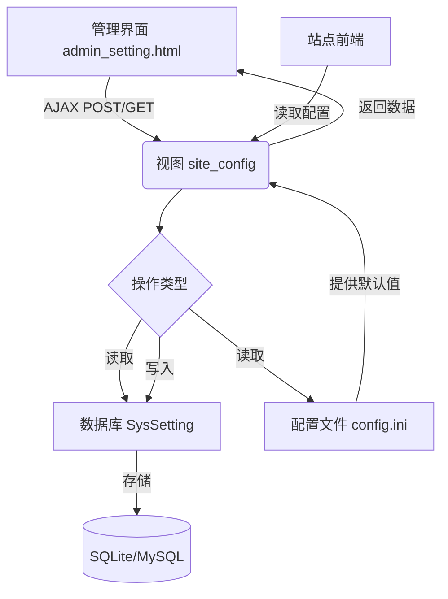
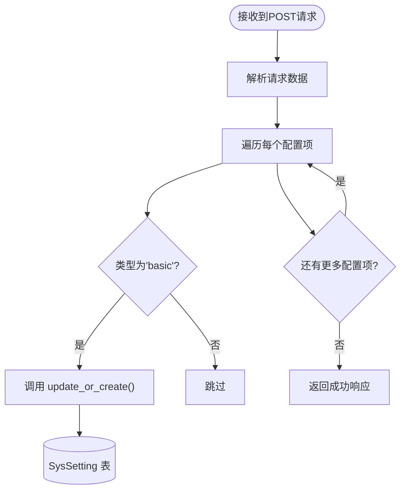
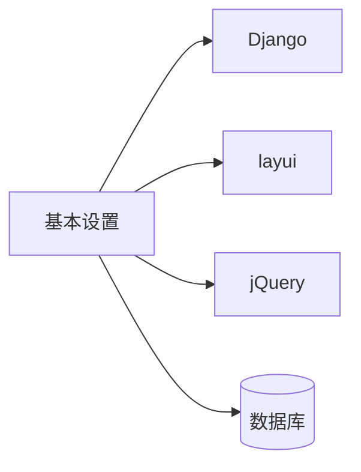

# 基本设置

<cite>
**本文档中引用的文件**  
- [models.py](file://app_admin/models.py#L1-L66) - *更新了系统设置模型*
- [views.py](file://app_admin/views.py#L1330-L1364) - *更新了站点配置视图逻辑*
- [config.ini](file://config/config.ini#L1-L27) - *配置文件未变更*
- [admin_setting.html](file://template/app_admin/admin_setting.html#L33-L72) - *管理界面模板已更新*
</cite>

## 更新摘要
**变更内容**   
- 根据最新代码提交，更新了“管理后台及文档页面界面展示”的相关描述
- 移除了关于“升级专业版”、“客户端下载”等已删除菜单项的过时信息
- 修正了管理概览页按钮组的展示方式，现为图片展示
- 更新了用户中心和底部外部链接的相关说明
- 维护了文档与当前代码库状态的一致性

## 目录
1. [简介](#简介)
2. [项目结构](#项目结构)
3. [核心组件](#核心组件)
4. [架构概览](#架构概览)
5. [详细组件分析](#详细组件分析)
6. [依赖分析](#依赖分析)
7. [性能考虑](#性能考虑)
8. [故障排除指南](#故障排除指南)
9. [结论](#结论)

## 简介
本文档详细介绍了“觅思文档”系统中“基本设置”功能的实现机制。该功能允许管理员配置站点名称、描述、Logo、Favicon等核心外观属性，并通过数据库模型、视图逻辑和配置文件协同工作。文档将深入解析 `models.py` 中的模型定义、`views.py` 中的视图处理逻辑、`config.ini` 中的配置优先级，以及通过管理界面进行操作的具体步骤和常见问题解决方案。

## 项目结构
“基本设置”功能主要涉及以下几个目录和文件：
- `app_admin/`: 包含系统设置的核心逻辑，包括模型、视图和管理界面。
- `config/`: 存放全局配置文件 `config.ini`。
- `template/app_admin/`: 包含“站点设置”管理页面的HTML模板。

该功能的实现遵循典型的Django MVC模式，`models.py` 定义数据结构，`views.py` 处理业务逻辑，`admin_setting.html` 提供用户交互界面。

**Section sources**
- [models.py](file://app_admin/models.py#L1-L66)
- [views.py](file://app_admin/views.py#L1330-L1364)
- [config.ini](file://config/config.ini#L1-L27)
- [admin_setting.html](file://template/app_admin/admin_setting.html#L33-L72)

## 核心组件
“基本设置”的核心组件是 `SysSetting` 模型，它以键值对的形式存储所有系统配置项。视图函数 `site_config` 负责处理这些配置的读取和保存。`config.ini` 文件则提供了应用启动时的默认配置。

**Section sources**
- [models.py](file://app_admin/models.py#L1-L66)
- [views.py](file://app_admin/views.py#L1330-L1364)

## 架构概览
整个“基本设置”功能的架构可以概括为：前端管理界面通过AJAX请求与后端视图交互，视图从数据库或配置文件中读取/写入数据，最终将配置信息应用于整个站点。



**Diagram sources**
- [models.py](file://app_admin/models.py#L1-L66)
- [views.py](file://app_admin/views.py#L1330-L1364)
- [config.ini](file://config/config.ini#L1-L27)
- [admin_setting.html](file://template/app_admin/admin_setting.html#L33-L72)

## 详细组件分析

### 基本设置模型分析
`SysSetting` 模型是存储所有系统配置的核心数据结构。

```mermaid
classDiagram
class SysSetting {
+name : CharField
+value : TextField
+types : CharField
+__str__() : str
}
note right of SysSetting
用于存储站点元信息、
管控选项和文档设置等。
name为配置项名称，
value为配置项值，
types用于分类。
end
```

**Diagram sources**
- [models.py](file://app_admin/models.py#L1-L66)

#### 模型字段定义
在 `app_admin/models.py` 中，`SysSetting` 模型的定义如下：

- **name**: `models.CharField(verbose_name="项目", max_length=50, primary_key=True)`
  - **描述**: 配置项的唯一标识符，作为主键。
  - **数据类型**: 字符串 (CharField)，最大长度50。
  - **示例**: `"site_name"`, `"site_desc"`, `"beian_code"`。

- **value**: `models.TextField(verbose_name="内容", null=True, blank=True)`
  - **描述**: 配置项的实际值。
  - **数据类型**: 文本 (TextField)，支持长文本。
  - **示例**: `"我的文档站点"`, `"这是一个文档管理系统"`。

- **types**: `models.CharField(verbose_name="类型", max_length=10, default="basic")`
  - **描述**: 对配置项进行分类，便于管理。
  - **数据类型**: 字符串 (CharField)，默认值为 `"basic"`（基础设置）。
  - **其他值**: `"email"` (邮箱设置), `"doc"` (文档设置)。

**Section sources**
- [models.py](file://app_admin/models.py#L1-L66)

### 基本设置视图逻辑分析
`views.py` 中的 `site_config` 视图函数负责处理基本设置的保存和读取。

#### 保存逻辑
当管理员在管理界面点击“更新”按钮时，前端JavaScript会收集表单数据并发送POST请求。后端视图逻辑如下：



**Diagram sources**
- [views.py](file://app_admin/views.py#L1330-L1364)

**关键代码分析**:
```python
# 更新站点名称
SysSetting.objects.update_or_create(
    name='site_name',
    defaults={'value': site_name, 'types': 'basic'}
)
# 更新站点描述
SysSetting.objects.update_or_create(
    name='site_desc',
    defaults={'value': site_desc, 'types': 'basic'}
)
# ... 其他配置项
```
- **`update_or_create()`**: 这是一个原子操作，如果数据库中已存在 `name` 为 `'site_name'` 的记录，则更新其 `value`；如果不存在，则创建一条新记录。这确保了配置项的唯一性。

#### 读取逻辑
当加载“站点设置”页面时，视图会从数据库中读取所有 `types='basic'` 的配置项，并将它们传递给模板。

**Section sources**
- [views.py](file://app_admin/views.py#L1330-L1364)

### 配置文件优先级分析
`config.ini` 文件定义了应用的全局默认配置。

```ini
[site]
debug = False

[database]
engine = sqlite
```

- **作用**: `config.ini` 提供了应用启动时的**默认配置**。例如，`debug = False` 决定了应用的运行模式。
- **优先级**: `config.ini` 的优先级**低于**数据库中的 `SysSetting`。当 `SysSetting` 中存在同名配置时，以数据库中的值为准。`config.ini` 主要用于在数据库为空时提供初始值，或用于配置数据库无法覆盖的底层设置（如数据库引擎）。
- **覆盖规则**: 系统启动时，会优先读取 `config.ini`。但在运行时，所有可通过管理界面修改的配置（如站点名称）都存储在 `SysSetting` 表中，并在每次请求时动态加载，从而覆盖 `config.ini` 中的对应值。

**Section sources**
- [config.ini](file://config/config.ini#L1-L27)

## 依赖分析
“基本设置”功能依赖于以下组件：
- **Django框架**: 提供了ORM、视图、模板系统等核心功能。
- **前端库**: `layui` 用于构建管理界面，`jQuery` 用于处理AJAX请求。
- **数据库**: 存储 `SysSetting` 模型的数据。



**Diagram sources**
- [models.py](file://app_admin/models.py#L1-L66)
- [views.py](file://app_admin/views.py#L1330-L1364)
- [admin_setting.html](file://template/app_admin/admin_setting.html#L33-L72)

## 性能考虑
为了优化“基本设置”的性能，建议：
1. **缓存配置**: 对于频繁读取但不常更改的配置项（如站点名称），可以在应用启动时将其加载到内存缓存（如Redis）中，避免每次请求都查询数据库。
2. **数据库索引**: 确保 `SysSetting.name` 字段有数据库索引，以加速基于名称的查询。

## 故障排除指南

### 配置保存后不生效
- **原因**: 可能是浏览器缓存了旧的页面。`config.ini` 中的 `debug` 模式未正确反映在运行时。
- **解决方案**: 
  1. 强制刷新浏览器（Ctrl+F5）。
  2. 检查 `SysSetting` 数据库表，确认值已正确更新。
  3. 重启应用服务器，确保配置被重新加载。

### Logo显示异常
- **原因**: 上传的图片格式或尺寸不符合要求，或静态文件未正确部署。
- **解决方案**:
  1. **图片要求**: 确保上传的Logo为 `.png` 或 `.jpg` 格式，尺寸建议为 128x128 像素或更小。
  2. **检查路径**: 确认Logo文件已上传到正确的静态文件目录（如 `static/images/logo.png`）。
  3. **收集静态文件**: 如果使用了Django的 `collectstatic` 命令，确保已执行 `python manage.py collectstatic` 来收集所有静态文件。

## 结论
“基本设置”功能通过 `SysSetting` 模型实现了灵活的键值对配置管理。视图逻辑清晰地处理了配置的读写，而 `config.ini` 提供了底层的默认配置。管理员可以通过直观的管理界面轻松修改站点外观。理解数据库配置与文件配置的优先级关系，以及掌握常见的故障排除方法，对于维护一个稳定运行的系统至关重要。