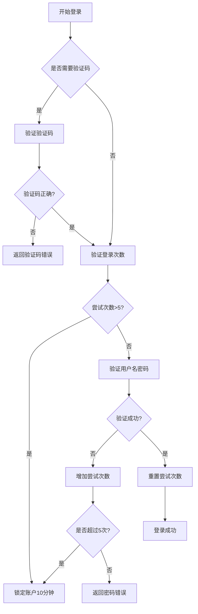
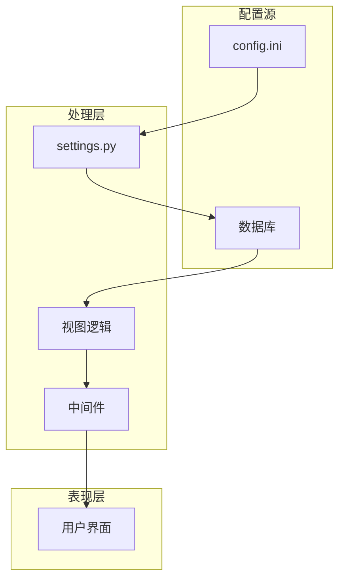
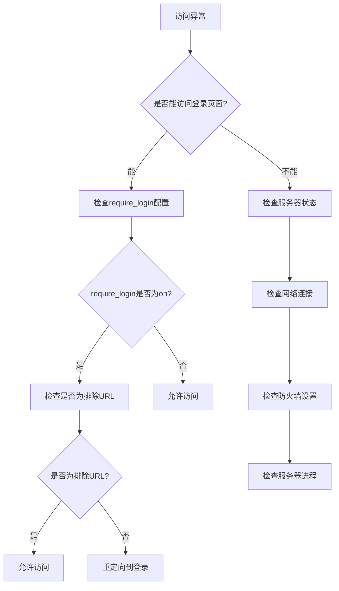
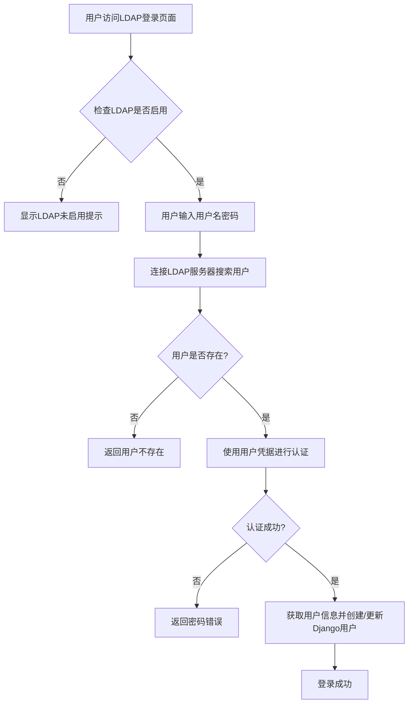

# 安全设置

<cite>
**本文档引用的文件**   
- [models.py](file://app_admin/models.py)
- [views.py](file://app_admin/views.py)
- [config.ini](file://config/config.ini)
- [settings.py](file://MrDoc/settings.py)
- [require_login_middleware.py](file://app_admin/middleware/require_login_middleware.py)
- [admin_setting.html](file://template/app_admin/admin_setting.html) - *在最近提交中更新*
- [ldap_backend.py](file://app_admin/ldap_backend.py) - *新增LDAP认证功能*
- [ldap_login.html](file://template/ldap_login.html) - *新增LDAP登录界面*
</cite>

## 更新摘要
**已做更改**   
- 新增“LDAP认证配置”章节，详细说明LDAP认证的启用与配置
- 在“安全配置概述”中添加LDAP认证功能说明
- 更新“安全配置处理逻辑”部分，增加LDAP登录流程说明
- 添加新的文件引用，包括ldap_backend.py和ldap_login.html
- 更新文档来源，包含新添加的LDAP相关文件
- 保持其余内容不变，因相关提交主要涉及LDAP功能的启用

## 目录
1. [安全配置概述](#安全配置概述)
2. [安全配置项定义](#安全配置项定义)
3. [安全配置处理逻辑](#安全配置处理逻辑)
4. [配置文件协同工作机制](#配置文件协同工作机制)
5. [中间件安全保护机制](#中间件安全保护机制)
6. [强密码策略与双因素认证](#强密码策略与双因素认证)
7. [故障排查方法](#故障排查方法)
8. [安全加固建议](#安全加固建议)
9. [LDAP认证配置](#ldap认证配置)

## 安全配置概述

本系统通过多层安全机制保障用户数据和系统安全，包括会话管理、登录控制、安全头设置、中间件保护等。安全配置主要分布在数据库模型、视图逻辑、配置文件和中间件中，通过协同工作实现全面的安全防护。近期对管理后台的整体界面进行了优化，提升了安全设置页面的用户体验。同时，系统已正式启用LDAP认证功能，支持企业级用户统一身份认证。

**Section sources**
- [models.py](file://app_admin/models.py#L1-L66)
- [views.py](file://app_admin/views.py#L0-L799)
- [config.ini](file://config/config.ini#L0-L26)
- [admin_setting.html](file://template/app_admin/admin_setting.html) - *在提交 eefd6ccf4768f72c61cffaf4c677c929c9463cdf 中更新*
- [ldap_backend.py](file://app_admin/ldap_backend.py#L0-L170) - *新增LDAP认证功能*

## 安全配置项定义

### 会话超时配置

系统会话超时时间在 `settings.py` 中通过 `SESSION_COOKIE_AGE` 配置项定义，其值从 `config.ini` 文件中读取：

```python
SESSION_COOKIE_AGE = int(CONFIG.get('session','cookie_age',fallback=604800)) # 会话过期时间，秒数
```

默认会话超时时间为 604800 秒（7 天），可通过修改 `config.ini` 文件中的 `session` 部分进行自定义。

### 登录尝试限制

在 `views.py` 的 `log_in` 视图函数中实现了登录尝试限制机制：

```python
# 验证登录次数
if 'LoginLock' not in request.session.keys():
    request.session['LoginNum'] = 1 # 重试次数
    request.session['LoginLock'] = False # 是否锁定
    request.session['LoginTime'] = datetime.datetime.now().timestamp() # 解除锁定时间
verify_num = request.session['LoginNum']
if verify_num > 5:
    request.session['LoginLock'] = True
    request.session['LoginTime'] = (datetime.datetime.now() + datetime.timedelta(minutes=10)).timestamp()
```

当用户连续 5 次登录失败后，系统将锁定该用户 10 分钟，防止暴力破解攻击。

### 安全头配置

系统在 `settings.py` 中配置了多项安全头，增强浏览器层面的安全防护：

```python
X_FRAME_OPTIONS = CONFIG.get("x_frame","option",fallback='SAMEORIGIN')
SECURE_CROSS_ORIGIN_OPENER_POLICY = 'None'
SESSION_COOKIE_SECURE = CONFIG.getboolean('session','cookie_secure',fallback=False)
SESSION_COOKIE_HTTPONLY = CONFIG.getboolean('session','cookie_httponly',fallback=True)
```

- **X-Frame-Options**: 防止点击劫持攻击，默认值为 `SAMEORIGIN`，允许同源页面嵌套
- **SESSION_COOKIE_HTTPONLY**: 防止 XSS 攻击窃取会话 Cookie，默认启用
- **SESSION_COOKIE_SECURE**: 仅通过 HTTPS 传输 Cookie，默认关闭

### 其他安全配置

在 `models.py` 中定义了 `SysSetting` 模型，用于存储系统安全设置：

```python
class SysSetting(models.Model):
    name = models.CharField(verbose_name="项目",max_length=50,primary_key=True)
    value = models.TextField(verbose_name="内容",null=True,blank=True)
    types = models.CharField(verbose_name="类型",max_length=10,default="basic")
```

该模型存储了多种安全相关配置，如：
- `enable_login_check_code`: 是否启用登录验证码
- `enable_register_code`: 是否启用注册邀请码
- `require_login`: 是否启用全站登录验证
- `close_register`: 是否关闭用户注册

**Section sources**
- [models.py](file://app_admin/models.py#L1-L66)
- [settings.py](file://MrDoc/settings.py#L275-L339)

## 安全配置处理逻辑

### 登录安全处理

`log_in` 视图函数实现了完整的登录安全处理流程：



近期对管理后台界面进行了优化，使登录安全设置的配置更加直观易用。

**Diagram sources**
- [views.py](file://app_admin/views.py#L100-L150)

### 注册安全处理

`register` 视图函数实现了注册安全控制：

```python
# 判断是否开启了注册码设置
is_register_code = SysSetting.objects.filter(types='basic', name='enable_register_code', value='on')
if is_register_code.exists():
    register_code = request.POST.get("register_code", None)
    # 验证注册码有效性
    current_date = timezone.now().date()
    register_code_value = RegisterCode.objects.get(code=register_code)
    if register_code_value.used_cnt >= register_code_value.all_cnt:
        errormsg = _('注册码使用次数已达限制!')
        return render(request, 'register.html', locals())
    elif register_code_value.expire_date is not None and register_code_value.expire_date < current_date:
        errormsg = _('注册码已过期!')
        return render(request, 'register.html', locals())
```

系统支持通过注册邀请码控制用户注册，确保只有授权用户才能注册。

### 密码重置安全

`forget_pwd` 视图实现了安全的密码重置流程，包括：
- 验证码发送和验证
- 验证码有效期检查（30分钟）
- 重试次数限制（5次后锁定10分钟）

```python
# 生成过期时间
now_time = datetime.datetime.now()
expire_time = now_time + datetime.timedelta(minutes=30)
```

**Section sources**
- [views.py](file://app_admin/views.py#L150-L300)

## 配置文件协同工作机制

### 配置文件层级结构

系统采用多层级配置文件协同工作机制，确保安全配置的灵活性和可维护性：



**Diagram sources**
- [config.ini](file://config/config.ini#L0-L26)
- [settings.py](file://MrDoc/settings.py#L0-L339)

### 配置加载流程

1. **基础配置加载**: `settings.py` 从 `config.ini` 加载基础安全配置
2. **动态配置加载**: 视图和中间件从数据库 `SysSetting` 表加载动态安全配置
3. **运行时应用**: 安全配置在运行时被应用到相应的功能模块

```python
# 从config.ini加载配置
CONFIG = ConfigParser()
CONFIG.read(os.path.join(CONFIG_DIR,'config.ini'),encoding='utf-8')

# 从数据库加载配置
require_login_data = SysSetting.objects.get(name='require_login').value
```

### 配置优先级

系统配置遵循以下优先级规则：
1. 数据库配置 > 配置文件配置（动态配置优先）
2. 代码默认值 < 配置文件值 < 数据库值
3. 安全敏感配置优先从数据库读取，确保可动态调整

**Section sources**
- [settings.py](file://MrDoc/settings.py#L0-L339)
- [models.py](file://app_admin/models.py#L1-L66)

## 中间件安全保护机制

### RequiredLoginMiddleware 工作原理

`require_login_middleware.py` 实现了全站登录验证中间件，其核心逻辑如下：

```python
class RequiredLoginMiddleware():
    def __init__(self, get_response):
        self.get_response = get_response
        # 设置排除URL
        compile_tuple = (
            r'/login(.*)$', # 登录
            r'/logout(.*)$', # 注销
            r'/register(.*)$', # 注册
            r'/check_code(.*)$', # 验证码
            r'/admin/forget_pwd(.*)$',  # 忘记密码
            r'/admin/send_email_vcode/(.*)$',  # 邮箱验证码
            r'/static/(.*)$', # 静态文件
            r'/media/(.*)$', # 媒体文件
            r'/share_doc(.*)$',  # 文档分享
            r'/api/(.*)$',  # token api 获取文集列表
        )
        self.exceptions = tuple(re.compile(url) for url in compile_tuple)

    def process_view(self, request, view_func, view_args, view_kwargs):
        # 登陆用户不理会
        if request.user.is_authenticated:
            return None

        try:
            # 获取数据库的设置值
            data = SysSetting.objects.get(name='require_login').value
            # 如果设置值为on，表示开启了验证
            if data == 'on':
                is_exceptions = False
                # 遍历排除列表
                for url in self.exceptions:
                    # 如果当前url匹配到排除列表，不理会
                    if url.match(request.path):
                        is_exceptions = True
                if is_exceptions:
                    return None
                else:
                    return login_required(view_func)(request, *view_args, **view_kwargs)
            else:
                return None
        except:
            # 如果查询异常，说明数据库无此设置值，不理会
            return None
```

### 中间件处理流程

```mermaid
sequenceDiagram
participant Client as "客户端"
participant Middleware as "中间件"
participant View as "视图"
Client->>Middleware : 请求页面
Middleware->>Middleware : 检查用户是否已登录
alt 用户已登录
Middleware-->>Client : 直接访问
else 用户未登录
Middleware->>Middleware : 检查require_login配置
alt 配置为on
Middleware->>Middleware : 检查是否为排除URL
alt 是排除URL
Middleware-->>Client : 允许访问
else 非排除URL
Middleware->>View : 重定向到登录页面
View-->>Client : 返回登录页面
end
end
else 配置为off
Middleware-->>Client : 允许访问
end
end
```

**Diagram sources**
- [require_login_middleware.py](file://app_admin/middleware/require_login_middleware.py#L0-L60)

### 排除URL列表

中间件定义了以下排除URL，这些页面无需登录即可访问：
- `/login(.*)$`: 登录页面
- `/logout(.*)$`: 注销页面
- `/register(.*)$`: 注册页面
- `/check_code(.*)$`: 验证码图片
- `/admin/forget_pwd(.*)$`: 忘记密码
- `/admin/send_email_vcode/(.*)$`: 邮箱验证码
- `/static/(.*)$`: 静态文件
- `/media/(.*)$`: 媒体文件
- `/share_doc(.*)$`: 文档分享
- `/api/(.*)$`: API 接口

**Section sources**
- [require_login_middleware.py](file://app_admin/middleware/require_login_middleware.py#L0-L60)

## 强密码策略与双因素认证

### 强密码策略

系统在多个层面实施了强密码策略：

1. **注册时密码验证**:
```python
elif len(password) < 6: # 验证密码长度
    errormsg = _('密码必须大于等于6位！')
    return render(request, 'register.html', locals())
```

2. **Django 内置密码验证器**:
```python
AUTH_PASSWORD_VALIDATORS = [
    {
        'NAME': 'django.contrib.auth.password_validation.UserAttributeSimilarityValidator',
    },
    {
        'NAME': 'django.contrib.auth.password_validation.MinimumLengthValidator',
    },
    {
        'NAME': 'django.contrib.auth.password_validation.CommonPasswordValidator',
    },
    {
        'NAME': 'django.contrib.auth.password_validation.NumericPasswordValidator',
    },
]
```

3. **密码修改时验证**:
```python
if password == password2:
    user.set_password(password)
    user.save()
else:
    return Response({'code': 5, 'data': _('两个密码不一致')})
```

### 双因素认证

当前系统未实现双因素认证（2FA）功能。系统通过以下方式增强账户安全：
- 邮箱验证码：用于密码重置
- 登录验证码：可配置启用
- 登录尝试限制：防止暴力破解
- 会话管理：可配置会话超时

建议未来版本中增加双因素认证功能，支持：
- TOTP（基于时间的一次性密码）
- 短信验证码
- 邮件验证码
- 推送通知确认

**Section sources**
- [views.py](file://app_admin/views.py#L150-L300)
- [settings.py](file://MrDoc/settings.py#L200-L210)

## 故障排查方法

### 访问异常排查

当用户遇到访问异常时，可按以下步骤排查：



**Diagram sources**
- [require_login_middleware.py](file://app_admin/middleware/require_login_middleware.py#L0-L60)

### 登录问题排查

#### 常见登录问题及解决方案：

| 问题现象 | 可能原因 | 解决方案 |
|---------|---------|---------|
| 验证码错误 | 验证码过期或输入错误 | 刷新验证码，正确输入 |
| 操作过于频繁 | 登录尝试超过5次 | 等待10分钟后重试 |
| 用户名或密码错误 | 凭据不正确 | 检查用户名密码，区分大小写 |
| 用户被禁用 | 账户被管理员禁用 | 联系管理员启用账户 |
| 无法访问登录页面 | 服务器或网络问题 | 检查服务器状态和网络连接 |

#### 登录问题排查流程：

1. **检查验证码**: 确认验证码输入正确，必要时刷新
2. **检查尝试次数**: 如果提示"操作过于频繁"，等待10分钟
3. **检查账户状态**: 确认账户未被禁用
4. **检查网络连接**: 确保网络正常
5. **检查服务器日志**: 查看 `log` 目录下的错误日志

**Section sources**
- [views.py](file://app_admin/views.py#L100-L150)
- [require_login_middleware.py](file://app_admin/middleware/require_login_middleware.py#L0-L60)

## 安全加固建议

### 定期安全审计

建议管理员定期执行以下安全审计：

1. **用户账户审计**:
   - 检查异常登录记录
   - 审核用户权限分配
   - 清理不活跃账户

2. **配置审计**:
   - 检查 `config.ini` 安全配置
   - 审核数据库中的 `SysSetting` 配置
   - 验证安全头设置

3. **日志审计**:
   - 分析 `log` 目录下的日志文件
   - 监控异常登录尝试
   - 记录安全事件

### 漏洞扫描

建议定期执行漏洞扫描，重点关注：

1. **Web 应用漏洞**:
   - SQL 注入
   - XSS 跨站脚本
   - CSRF 跨站请求伪造
   - 文件上传漏洞

2. **配置漏洞**:
   - 敏感信息泄露
   - 不安全的默认配置
   - 过时的依赖库

3. **网络漏洞**:
   - 开放的危险端口
   - 弱密码策略
   - 未加密的通信

### 安全最佳实践

1. **配置建议**:
   - 生产环境设置 `debug = False`
   - 启用 `SESSION_COOKIE_SECURE`（使用 HTTPS）
   - 定期更新会话超时时间
   - 启用登录验证码

2. **密码策略**:
   - 建议密码长度至少8位
   - 要求包含大小写字母、数字和特殊字符
   - 定期强制用户更换密码
   - 禁止使用常见弱密码

3. **访问控制**:
   - 启用全站登录验证
   - 使用注册邀请码控制用户增长
   - 定期审查用户权限
   - 实施最小权限原则

4. **备份与恢复**:
   - 定期备份数据库
   - 测试备份恢复流程
   - 将备份存储在安全位置
   - 加密敏感备份数据

**Section sources**
- [config.ini](file://config/config.ini#L0-L26)
- [settings.py](file://MrDoc/settings.py#L0-L339)
- [models.py](file://app_admin/models.py#L1-L66)

## LDAP认证配置

### LDAP认证启用与配置

系统已正式启用LDAP认证功能，支持企业级用户统一身份认证。LDAP配置在 `config.ini` 文件中定义：

```ini
[ldap]
# LDAP认证配置
# 是否启用LDAP认证，true表示启用，false表示禁用
enable_ldap = true
# LDAP服务器地址
server_uri = ldap://127.0.0.1:389
# 绑定DN，用于连接LDAP服务器进行搜索
bind_dn = cn=admin,dc=example,dc=com
# 绑定密码
bind_password = adminpassword
# 用户搜索基础DN
user_base_dn = ou=users,dc=example,dc=com
# 用户搜索过滤器，{username}会被替换为实际的用户名
user_search_filter = (uid={username})
# 用户属性映射
user_attr_username = uid
user_attr_email = mail
user_attr_first_name = givenName
user_attr_last_name = sn
```

### LDAP认证流程

LDAP认证通过自定义认证后端 `LDAPBackend` 实现，其工作流程如下：



**Diagram sources**
- [ldap_backend.py](file://app_admin/ldap_backend.py#L0-L170)
- [views.py](file://app_admin/views.py#L243-L331)

### LDAP认证实现

`LDAPBackend` 类实现了Django的自定义认证后端，主要功能包括：

1. **初始化配置**:
```python
def __init__(self):
    """初始化LDAP配置"""
    self.config = ConfigParser()
    config_path = os.path.join(settings.BASE_DIR, 'config', 'config.ini')
    self.config.read(config_path, encoding='utf-8')
    
    # LDAP配置，优先使用环境变量，其次使用配置文件
    self.server_uri = os.getenv('LDAP_SERVER_URI') or self.config.get('ldap', 'server_uri', fallback='ldap://localhost:389')
    self.bind_dn = os.getenv('LDAP_BIND_DN') or self.config.get('ldap', 'bind_dn', fallback='')
    self.bind_password = os.getenv('LDAP_BIND_PASSWORD') or self.config.get('ldap', 'bind_password', fallback='')
    self.user_base_dn = os.getenv('LDAP_USER_BASE_DN') or self.config.get('ldap', 'user_base_dn', fallback='')
    self.user_search_filter = os.getenv('LDAP_USER_SEARCH_FILTER') or self.config.get('ldap', 'user_search_filter', fallback='(uid={username})')
```

2. **用户认证**:
```python
def authenticate(self, request, username=None, password=None, **kwargs):
    """
    LDAP认证方法
    """
    if not username or not password:
        return None
        
    try:
        # 检查是否启用LDAP认证（优先使用环境变量）
        enable_ldap_env = os.getenv('LDAP_ENABLE')
        if enable_ldap_env is not None:
            enable_ldap = enable_ldap_env.lower() in ('true', '1', 'yes', 'on')
        else:
            enable_ldap = self.config.getboolean('ldap', 'enable_ldap', fallback=False)
            
        if not enable_ldap:
            return None
            
        # 创建LDAP服务器连接
        server = ldap3.Server(self.server_uri, get_info=ldap3.ALL)
        
        # 使用管理员账户连接LDAP进行用户搜索
        conn = ldap3.Connection(server, self.bind_dn, self.bind_password, auto_bind=True)
        
        # 搜索用户
        search_filter = self.user_search_filter.format(username=username)
        conn.search(
            self.user_base_dn,
            search_filter,
            attributes=[self.attr_username, self.attr_email, 
                       self.attr_first_name, self.attr_last_name]
        )
        
        if not conn.entries:
            logger.info(f"LDAP用户 {username} 不存在")
            return None
            
        # 获取用户DN
        user_entry = conn.entries[0]
        user_dn = user_entry.entry_dn
        
        # 关闭管理员连接
        conn.unbind()
        
        # 使用用户凭据进行认证
        user_conn = ldap3.Connection(server, user_dn, password)
        
        if not user_conn.bind():
            logger.info(f"LDAP用户 {username} 密码错误")
            return None
            
        # 认证成功，获取用户信息
        user_info = {
            'username': username,
            'email': getattr(user_entry, self.attr_email, [username + '@example.com'])[0] if hasattr(user_entry, self.attr_email) else username + '@example.com',
            'first_name': getattr(user_entry, self.attr_first_name, [''])[0] if hasattr(user_entry, self.attr_first_name) else '',
            'last_name': getattr(user_entry, self.attr_last_name, [''])[0] if hasattr(user_entry, self.attr_last_name) else ''
        }
        
        # 关闭用户连接
        user_conn.unbind()
        
        # 获取或创建Django用户
        user = self.get_or_create_user(user_info)
        
        logger.info(f"LDAP用户 {username} 认证成功")
        return user
        
    except Exception as e:
        logger.error(f"LDAP认证失败: {e}")
        return None
```

3. **用户同步**:
```python
def get_or_create_user(self, user_info):
    """
    获取或创建Django用户
    """
    try:
        # 尝试获取现有用户
        user = User.objects.get(username=user_info['username'])
        
        # 更新用户信息
        user.email = user_info['email']
        user.first_name = user_info['first_name']
        user.last_name = user_info['last_name']
        user.is_active = True
        user.save()
        
    except User.DoesNotExist:
        # 创建新用户 - 权限默认为普通用户
        user = User.objects.create_user(
            username=user_info['username'],
            email=user_info['email'],
            first_name=user_info['first_name'],
            last_name=user_info['last_name'],
            is_staff=False,  # 不是管理员
            is_superuser=False,  # 不是超级用户
            is_active=True,
            password=None  # LDAP用户不设置本地密码
        )
        logger.info(f"创建LDAP用户: {user_info['username']}")
        
    return user
```

### LDAP登录安全

系统为LDAP登录实现了专门的安全保护机制：

1. **登录尝试限制**:
```python
# 验证登录次数（防止暴力破解）
if 'LDAPLoginLock' not in request.session.keys():
    request.session['LDAPLoginNum'] = 1
    request.session['LDAPLoginLock'] = False
    request.session['LDAPLoginTime'] = datetime.datetime.now().timestamp()
    
verify_num = request.session['LDAPLoginNum']
if verify_num > 5:
    request.session['LDAPLoginLock'] = True
    request.session['LDAPLoginTime'] = (datetime.datetime.now() + datetime.timedelta(minutes=10)).timestamp()
```

2. **登录流程**:
```python
# 使用LDAP后端进行认证
ldap_backend = LDAPBackend()
user = ldap_backend.authenticate(request, username=username, password=password)
```

**Section sources**
- [ldap_backend.py](file://app_admin/ldap_backend.py#L0-L170)
- [views.py](file://app_admin/views.py#L243-L331)
- [config.ini](file://config/config.ini#L0-L52)
- [ldap_login.html](file://template/ldap_login.html#L0-L116)