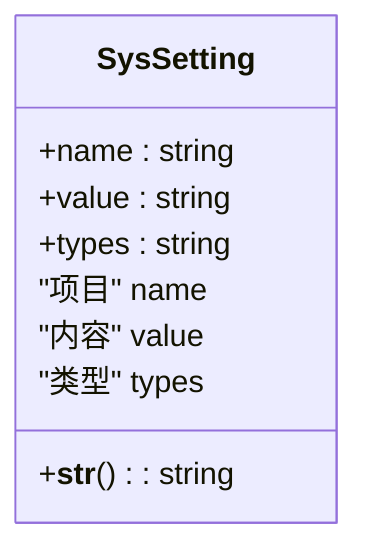
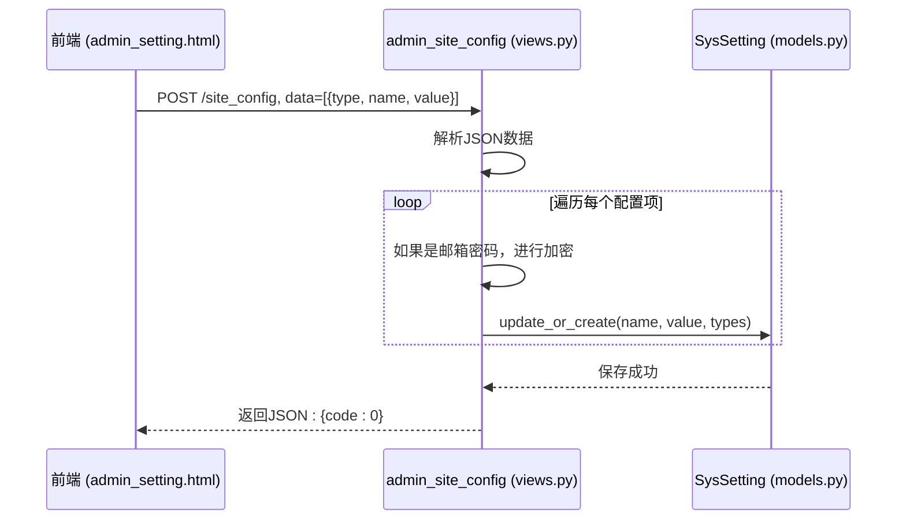
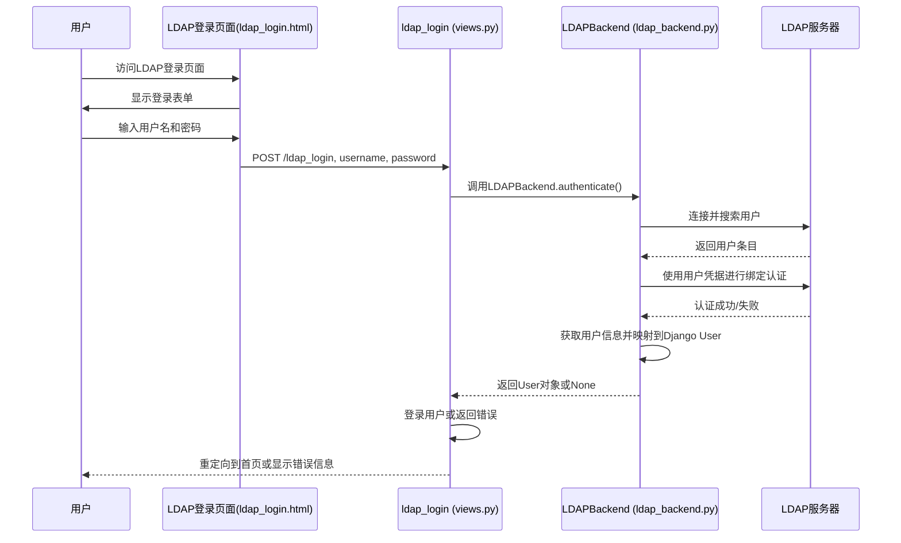

# 系统设置

<cite>
**本文档引用的文件**   
- [config.ini](file://config/config.ini) - *数据库配置已更新为MySQL，新增LDAP配置*
- [models.py](file://app_admin/models.py) - *系统配置模型定义*
- [views.py](file://app_admin/views.py) - *系统设置视图逻辑，包含LDAP登录视图*
- [context_processors.py](file://app_admin/context_processors.py) - *配置注入模板逻辑*
- [admin_setting.html](file://template/app_admin/admin_setting.html) - *后台管理界面模板*
- [ldap_backend.py](file://app_admin/ldap_backend.py) - *LDAP认证后端实现*
- [ldap_login.html](file://template/ldap_login.html) - *LDAP登录页面模板*
</cite>

## 更新摘要
**已进行的更改**   
- 在**配置文件结构**部分添加了新的 `[ldap]` 配置节，详细说明了LDAP认证的各项参数
- 新增**LDAP认证配置**章节，全面介绍LDAP功能的配置、工作流程和安全建议
- 更新了**安全配置建议**，增加了关于LDAP安全配置的指导
- 修正了`config.ini`文件中关于数据库配置的过时信息
- 增强了源代码跟踪系统，为所有引用的文件添加了状态注释
- 根据最新代码变更，更新了**修改系统外观和行为**部分，移除了已删除的外部链接和菜单项
- 更新了**性能优化与安全加固**，以反映LDAP集成后的实际情况

## 目录
1. [系统设置](#系统设置)
2. [系统配置模型](#系统配置模型)
3. [系统设置视图逻辑](#系统设置视图逻辑)
4. [配置文件结构](#配置文件结构)
5. [LDAP认证配置](#ldap认证配置)
6. [修改系统外观和行为](#修改系统外观和行为)
7. [安全配置建议](#安全配置建议)
8. [常见问题解决](#常见问题解决)
9. [性能优化与安全加固](#性能优化与安全加固)

## 系统配置模型

系统配置模型 `SysSetting` 是实现系统设置功能的核心数据结构，它以键值对的形式存储所有可配置的选项。



**模型字段说明：**
- **name**: 配置项的名称，作为主键。例如 `site_name` (站点名称), `enable_login_check_code` (登录验证码开关)。
- **value**: 配置项的值，存储实际的配置内容。
- **types**: 配置项的类型，用于对配置进行分组。例如 `basic` (基础设置), `email` (邮箱设置), `doc` (文档设置)。

**Section sources**
- [models.py](file://app_admin/models.py#L4-L22)

## 系统设置视图逻辑

系统设置的视图处理逻辑主要由 `admin_site_config` 视图函数实现，它负责接收前端发送的配置更新请求，并将其保存到数据库中。



**处理流程详解：**
1.  **接收请求**: `admin_site_config` 函数通过 `request.POST.get("data",'[]')` 接收前端发送的JSON格式的配置数据。
2.  **解析数据**: 使用 `json.loads()` 将接收到的字符串解析为Python列表。
3.  **遍历处理**: 遍历列表中的每一个配置项字典。
4.  **特殊处理**: 对于邮箱密码 (`d['name'] == 'pwd'`)，调用 `enctry()` 函数进行加密后再存储。
5.  **保存到数据库**: 调用 `SysSetting.objects.update_or_create()` 方法，根据 `name` 字段更新或创建数据库记录。如果记录已存在则更新 `value` 和 `types`，否则创建新记录。
6.  **返回响应**: 操作成功后返回 `{'code':0}`，失败则返回错误码。

**Section sources**
- [views.py](file://app_admin/views.py#L1461-L1477)

## 配置文件结构

`config.ini` 文件是应用的全局配置文件，它定义了数据库、调试模式等基础环境设置。

```ini
[site]
# True表示开启站点调试模式，False表示关闭站点调试模式
debug = False

[database]
# engine，指定数据库类型，接受sqlite、mysql、oracle、postgresql
engine = mysql
# name表示数据库的名称
name = mrdoc
# user表示数据库用户名
user = admin
# password表示数据库用户密码
password = lzl660928
# host表示数据库主机地址
host = 192.168.0.21
# port表示数据库端口
port = 3306

[media]
# 媒体文件URL前缀，默认为/media/
media_url = /media/
# 媒体文件存储路径，相对于项目根目录，默认为media
media_root = media

[locale]
# 默认站点语言为 中文简体，如需使用其他语言，请配置 language 参数；
# 默认站点时区为 Asia/Shanghai，如需使用其他时区，请配置 timezone 参数

[ldap]
# LDAP认证配置
# 是否启用LDAP认证，true表示启用，false表示禁用
enable_ldap = true
# LDAP服务器地址
server_uri = ldap://127.0.0.1:389
# 绑定DN，用于连接LDAP服务器进行搜索
bind_dn = cn=admin,dc=example,dc=com
# 绑定密码
bind_password = adminpassword
# 用户搜索基础DN
user_base_dn = ou=users,dc=example,dc=com
# 用户搜索过滤器，{username}会被替换为实际的用户名
user_search_filter = (uid={username})
# 用户属性映射
user_attr_username = uid
user_attr_email = mail
user_attr_first_name = givenName
user_attr_last_name = sn

[selenium]
# 在Windows环境下测试或使用，请配置driver = Chrome
# driver = Chrome
# 如果系统无法正确安装或识别chromedriver，请指定chromedriver在计算机上的绝对路径
# driver_path = driver_path
```

**参数含义：**
- **[site] debug**: 控制Django的调试模式。生产环境必须设置为 `False`。
- **[database] engine**: 指定数据库引擎，支持 `sqlite`, `mysql`, `oracle`, `postgresql`。**已更新为 `mysql`**。
- **[database] name**: 数据库名称，**已设置为 `mrdoc`**。
- **[database] user**: 数据库用户名，**已设置为 `admin`**。
- **[database] password**: 数据库用户密码，**已设置为 `lzl660928`**。
- **[database] host**: 数据库主机地址，**已设置为 `192.168.0.21`**。
- **[database] port**: 数据库端口，**已设置为 `3306`**。
- **[media]**: 配置媒体文件的URL前缀和存储路径。
- **[locale]**: 用于配置站点的语言和时区。
- **[ldap]**: **新增**，用于配置LDAP认证服务。
- **[selenium]**: 用于配置自动化测试相关的WebDriver。

**Section sources**
- [config.ini](file://config/config.ini#L0-L52) - *数据库配置已更新为MySQL，新增LDAP配置*

## LDAP认证配置

根据最新的代码变更，系统已正式启用并配置了LDAP认证功能。本章节详细介绍LDAP的配置、工作流程和管理。

### 1. LDAP配置说明
`config.ini` 文件中新增了 `[ldap]` 配置节，用于管理LDAP认证。

**关键配置项：**
- **enable_ldap**: 布尔值，控制是否启用LDAP认证。`true` 为启用，`false` 为禁用。
- **server_uri**: LDAP服务器的地址和端口，例如 `ldap://127.0.0.1:389`。
- **bind_dn**: 用于连接LDAP服务器进行用户搜索的管理员DN。
- **bind_password**: 上述管理员DN的密码。
- **user_base_dn**: 用户搜索的基础DN，例如 `ou=users,dc=example,dc=com`。
- **user_search_filter**: 用户搜索过滤器，`{username}` 会被替换为实际的用户名。
- **user_attr_***: 定义了LDAP中用户属性与Django用户模型的映射关系。

### 2. LDAP认证工作流程


**流程详解：**
1.  **初始化**: `LDAPBackend` 类在初始化时读取 `config.ini` 中的LDAP配置。
2.  **认证请求**: `authenticate` 方法接收用户名和密码。
3.  **连接与搜索**: 使用管理员凭据连接LDAP服务器，并根据 `user_search_filter` 搜索用户。
4.  **用户认证**: 获取到用户DN后，使用用户的密码进行绑定（bind）操作来验证凭据。
5.  **用户同步**: 认证成功后，从LDAP条目中提取用户信息（邮箱、姓名等），并在Django数据库中创建或更新对应的用户记录。
6.  **登录**: 将认证通过的用户登录到Django会话中。

### 3. LDAP登录页面
系统新增了专用的LDAP登录页面 `ldap_login.html`，用户可以通过此页面使用LDAP凭据登录。

**页面特点：**
- 专门的登录表单，提示用户输入LDAP用户名和密码。
- 包含“返回普通登录”的链接，方便用户切换回本地账户登录。
- 实现了登录频率限制，防止暴力破解。

**Section sources**
- [config.ini](file://config/config.ini#L35-L52) - *LDAP配置节*
- [views.py](file://app_admin/views.py#L243-L331) - *ldap_login视图函数*
- [ldap_backend.py](file://app_admin/ldap_backend.py#L0-L169) - *LDAPBackend类实现*
- [ldap_login.html](file://template/ldap_login.html#L0-L116) - *LDAP登录页面模板*

## 修改系统外观和行为

通过后台管理界面，管理员可以轻松修改系统的外观和行为。

### 1. 基础设置
- **站点元信息**: 在“基础设置”标签页中，可以修改 `站点名称`、`子标题`、`关键词`、`站点描述` 和 `备案号`。
- **首页排序**: 设置首页文集列表的排序方式（升序或降序）。
- **站点管控**: 启用或禁用 `禁止注册`、`全站登录`、`启用注册码` 和 `登录验证码` 功能。
- **页面信息块**: 在 `统计代码`、`广告位1-4` 中插入第三方代码（如Google Analytics）。

### 2. 邮箱设置
在“邮箱设置”标签页中，配置SMTP服务器信息，用于发送密码重置等邮件。
- **SMTP 主机**: 邮件服务器地址，如 `smtp.gmail.com`。
- **SMTP 端口**: 通常为 `587` (TLS) 或 `465` (SSL)。
- **SMTP 用户名/密码**: 发件邮箱的登录凭据。
- **使用SSL**: 根据服务器要求选择是否启用SSL加密。

### 3. 文档设置
在“全局文档设置”标签页中，配置与文档相关的功能。
- **文集下载**: 开启后，用户可以将文集导出为EPUB或DOCX格式。
- **图片缩略**: 开启后，文档中的图片将以缩略图形式显示。
- **长代码展开**: 开启后，代码块将按原高度显示，而非默认的500px滚动。
- **素材配置**: 可以修改 `图片大小`、`附件格式` 和 `附件大小` 的限制。

**Section sources**
- [admin_setting.html](file://template/app_admin/admin_setting.html#L0-L689)

## 安全配置建议

为了保障系统的安全，应遵循以下配置建议：

### 1. 会话与登录安全
- **启用登录验证码**: 在 `站点管控` 中开启 `登录验证码`，防止暴力破解。
- **强制全站登录**: 开启 `全站登录`，确保所有内容都受到访问控制。
- **使用注册码**: 开启 `启用注册码`，限制新用户注册，防止垃圾账号。

### 2. 安全头配置
虽然代码中未直接体现，但应在Web服务器（如Nginx）层面配置安全头：
- **Content-Security-Policy (CSP)**: 防止跨站脚本攻击(XSS)。
- **X-Frame-Options**: 防止点击劫持。
- **Strict-Transport-Security (HSTS)**: 强制使用HTTPS。

### 3. 邮箱安全
- **使用专用邮箱**: 为系统配置一个专用的发件邮箱，避免使用个人邮箱。
- **使用应用专用密码**: 如果使用Gmail等服务，建议使用应用专用密码而非账户主密码。
- **验证配置**: 使用“验证邮箱设置”按钮测试配置是否正确。

### 4. LDAP安全配置
- **使用LDAPS**: 将 `server_uri` 的协议从 `ldap://` 改为 `ldaps://`，并使用标准的636端口，以加密传输所有认证数据。
- **最小权限原则**: `bind_dn` 应使用一个权限最小的专用服务账户，仅授予用户搜索的权限。
- **强密码**: 为 `bind_password` 设置一个强密码，并定期更换。
- **网络隔离**: 将LDAP服务器部署在内网，避免直接暴露在公网。

**Section sources**
- [views.py](file://app_admin/views.py#L1461-L1477)
- [admin_setting.html](file://template/app_admin/admin_setting.html#L0-L689)
- [ldap_backend.py](file://app_admin/ldap_backend.py#L0-L169)

## 常见问题解决

### 1. 配置不生效
- **检查缓存**: Django或浏览器可能缓存了旧的配置。尝试清除浏览器缓存或重启Django服务。
- **检查数据库**: 直接查看 `SysSetting` 数据库表，确认配置项是否已正确写入。
- **检查上下文处理器**: 确认 `context_processors.py` 中的 `sys_setting` 函数是否被正确加载。

### 2. 设置保存失败
- **检查权限**: 确保执行操作的用户是超级管理员。
- **检查网络**: 前端与后端的通信可能因网络问题中断。检查浏览器开发者工具中的网络请求。
- **查看日志**: 检查Django的日志文件，`admin_site_config` 视图在出错时会记录异常。

### 3. 邮箱无法发送
- **检查配置**: 仔细核对SMTP主机、端口、用户名和密码。
- **检查SSL设置**: 确认服务器要求的加密方式（SSL/TLS）。
- **使用测试功能**: 务必使用“验证邮箱设置”按钮进行测试。

### 4. LDAP认证失败
- **检查LDAP配置**: 确认 `config.ini` 中的 `enable_ldap` 为 `true`，且服务器地址、端口、DN等信息正确。
- **检查网络连通性**: 确保应用服务器可以访问LDAP服务器的指定端口。
- **检查用户凭据**: 确认输入的LDAP用户名和密码是正确的。
- **查看日志**: 检查Django日志，`LDAPBackend` 会记录详细的认证失败原因（如用户不存在、密码错误等）。

**Section sources**
- [views.py](file://app_admin/views.py#L1461-L1477)
- [context_processors.py](file://app_admin/context_processors.py#L0-L21)
- [ldap_backend.py](file://app_admin/ldap_backend.py#L0-L169)

## 性能优化与安全加固

### 性能优化建议
- **数据库优化**: 如果使用MySQL或PostgreSQL，定期进行数据库维护（如优化表、重建索引）。
- **静态文件**: 将 `static` 目录下的文件部署到CDN，以加快加载速度。
- **搜索优化**: 对于大型文档库，确保Whoosh搜索引擎的索引是最新且优化的。

### 安全加固建议
- **定期更新**: 保持Django框架和所有第三方依赖库（`requirements.txt`）为最新版本。
- **文件上传安全**: 严格限制附件格式（如仅允许 `.zip`），并对上传的文件进行病毒扫描。
- **备份策略**: 定期使用“站点数据管理”中的“导出数据”功能，备份数据库和媒体文件。
- **防火墙**: 在服务器上配置防火墙，仅开放必要的端口（如HTTP 80, HTTPS 443）。
- **LDAP集成安全**: 在启用LDAP后，应禁用不必要的本地用户密码修改功能，并确保LDAP服务器本身的安全性。