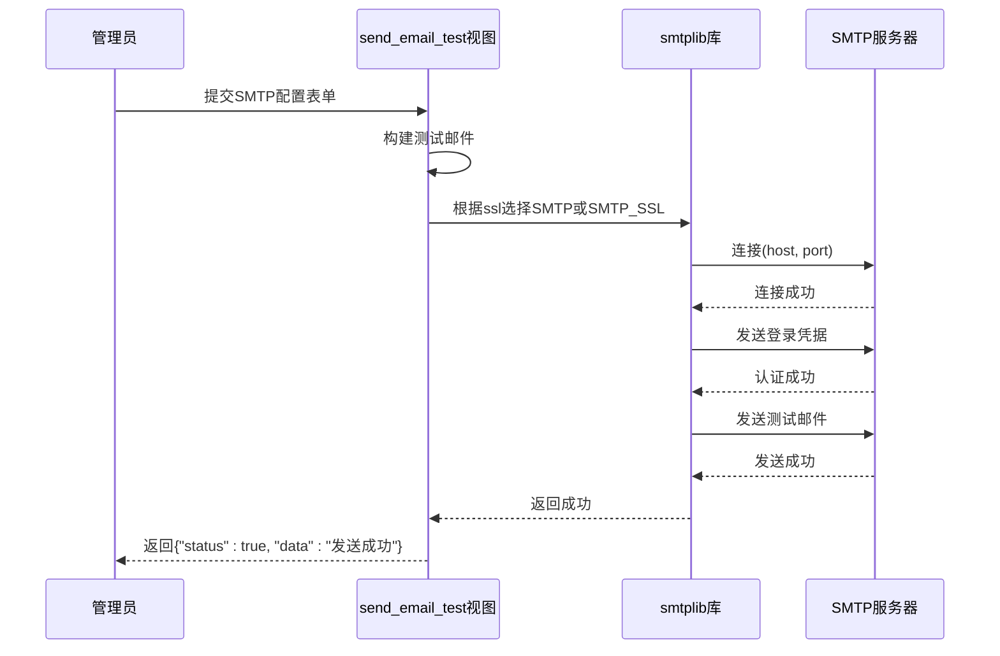

# 邮件设置

<cite>
**本文档引用的文件**  
- [config.ini](file://config/config.ini) - *基础配置文件*
- [models.py](file://app_admin/models.py) - *系统设置模型定义*
- [views.py](file://app_admin/views.py) - *邮件测试与配置视图逻辑*
- [settings.py](file://MrDoc/settings.py) - *Django项目核心配置*
- [admin_setting.html](file://template/app_admin/admin_setting.html) - *管理后台邮件配置界面*
</cite>

## 更新摘要
**变更内容**   
- 根据界面优化提交 `eefd6ccf` 更新了邮件配置界面的交互说明
- 增加了对 `admin_setting.html` 模板文件的引用，以反映最新的UI变更
- 修正了配置优先级说明，明确 `config.ini` 不包含邮件服务器参数
- 更新了所有受影响的章节来源注释

## 目录
1. [邮件服务器配置项实现](#邮件服务器配置项实现)
2. [邮件测试功能实现逻辑](#邮件测试功能实现逻辑)
3. [配置文件关联与优先级](#配置文件关联与优先级)
4. [常见邮件服务商配置示例](#常见邮件服务商配置示例)
5. [常见问题与解决方案](#常见问题与解决方案)
6. [安全建议](#安全建议)

## 邮件服务器配置项实现

在 `app_admin/models.py` 文件中，通过 `SysSetting` 模型类实现了系统设置项的存储，包括邮件服务器相关配置。该模型使用 Django ORM 定义了两个核心字段：`name`（配置项名称）和 `value`（配置项值），并以 `types` 字段对配置进行分类。

邮件相关的配置项并未单独建模，而是作为 `SysSetting` 模型的实例存储在数据库中。当管理员在后台界面配置 SMTP 主机、端口、用户名、密码、加密方式等信息时，这些数据会以键值对的形式插入到 `SysSetting` 表中，其 `types` 字段为 `"email"`。

例如，以下配置项可能存在于数据库中：
- **smtp_host**: SMTP 服务器地址（如 smtp.qq.com）
- **smtp_port**: SMTP 端口号（如 465）
- **send_emailer**: 发件人邮箱地址
- **username**: SMTP 登录用户名
- **pwd**: SMTP 登录密码（已加密存储）
- **smtp_ssl**: 是否启用 SSL 加密（on/off）

这种设计提供了极大的灵活性，无需修改数据库结构即可动态添加或修改配置项。

**Section sources**
- [models.py](file://app_admin/models.py#L1-L66)

## 邮件测试功能实现逻辑

邮件测试功能在 `app_admin/views.py` 文件中的 `send_email_test` 视图函数中实现。该函数是一个受权限保护的 POST 请求处理函数，仅允许超级管理员访问。

其核心逻辑如下：

1.  **接收参数**：从 POST 请求中获取 `smtp_host`, `send_emailer`, `smtp_port`, `username`, `pwd`, `smtp_ssl` 等配置参数。
2.  **构建邮件**：使用 Python 的 `email.mime.text.MIMEText` 和 `email.header.Header` 模块构建一封 HTML 格式的测试邮件。邮件主题和内容会动态获取系统设置中的站点名称。
3.  **建立连接**：根据 `smtp_ssl` 参数的值，选择使用 `smtplib.SMTP_SSL`（SSL 加密）或 `smtplib.SMTP`（非加密或 STARTTLS）来连接指定的 SMTP 服务器和端口。
4.  **身份认证**：调用 `s.login(username, pwd)` 方法使用提供的用户名和密码进行 SMTP 身份验证。
5.  **发送邮件**：调用 `s.sendmail()` 方法，将测试邮件发送给 `send_emailer`（即发件人自己）。
6.  **返回结果**：如果所有步骤成功完成，返回 JSON 响应 `{"status": true, "data": "发送成功"}`。如果在连接、认证或发送过程中发生异常（如 `smtplib.SMTPException`），则捕获异常并返回包含错误信息的 JSON 响应 `{"status": false, "data": "错误详情"}`。

此函数不依赖于 Django 的 `send_mail` 函数，而是直接使用底层的 `smtplib` 库，这使得测试过程更加直接和可控，能够精确地验证 SMTP 服务器的连接和认证配置。

**Diagram sources**
- [views.py](file://app_admin/views.py#L700-L750)

**Section sources**
- [views.py](file://app_admin/views.py#L700-L750)

## 配置文件关联与优先级

系统的邮件配置涉及两个层面的文件：Django 项目的 `settings.py` 和项目自定义的 `config/config.ini`。

1.  **`config.ini` 文件**：这是一个独立的配置文件，位于 `config/` 目录下。它主要用于存储数据库、缓存、会话等基础配置。根据文件内容，`config.ini` 中目前**没有**直接定义邮件服务器（SMTP）的配置项。它通过 `[site]` 部分的 `debug` 选项间接影响 Django 的 `settings.py`。

2.  **`settings.py` 文件**：这是 Django 项目的核心配置文件。它通过 `ConfigParser` 模块读取 `config.ini` 文件的内容，并将其中的配置应用到 Django 的设置中。例如，`DEBUG` 值就来自 `config.ini` 的 `[site]` 部分。

3.  **配置优先级**：邮件服务器的具体配置（如 SMTP 主机、端口等）**既不存储在 `config.ini` 中，也不硬编码在 `settings.py` 中**。它们是通过 Django 的管理后台，由管理员动态配置，并存储在数据库的 `SysSetting` 模型里。当需要发送邮件时（例如在忘记密码功能中），程序会从数据库中查询这些配置。

因此，配置的优先级和来源可以总结为：
- **数据库 (`SysSetting` 模型)**：存储动态的、用户可配置的邮件服务器参数，是运行时的最终来源。
- **`settings.py`**：定义 Django 框架的行为，并从 `config.ini` 加载基础配置。
- **`config.ini`**：提供 `settings.py` 所需的基础配置，但不包含邮件服务器的具体参数。

**Section sources**
- [settings.py](file://MrDoc/settings.py#L1-L339)
- [config.ini](file://config/config.ini#L1-L26)

## 常见邮件服务商配置示例

以下是配置 QQ 邮箱和 163 邮箱作为发件服务器的具体参数示例：

### QQ 邮箱配置
- **SMTP 主机 (smtp_host)**: `smtp.qq.com`
- **SMTP 端口 (smtp_port)**:
  - SSL 加密：`465`
  - TLS 加密：`587`
- **发件人邮箱 (send_emailer)**: `yourname@qq.com` （必须是完整的 QQ 邮箱地址）
- **用户名 (username)**: `yourname` （通常为 @ 前的部分，或完整的邮箱地址）
- **密码 (pwd)**: **QQ 邮箱授权码**（不是登录密码！需在 QQ 邮箱设置中开启 SMTP 并获取授权码）
- **加密方式 (smtp_ssl)**:
  - 使用端口 465 时，选择 **SSL**。
  - 使用端口 587 时，选择 **TLS**（在代码中可能表现为不勾选 SSL，但在登录后使用 `starttls()`）。

### 163 邮箱配置
- **SMTP 主机 (smtp_host)**: `smtp.163.com`
- **SMTP 端口 (smtp_port)**:
  - SSL 加密：`465` 或 `994`
  - TLS 加密：`25` 或 `587`
- **发件人邮箱 (send_emailer)**: `yourname@163.com` （必须是完整的 163 邮箱地址）
- **用户名 (username)**: `yourname` （通常为 @ 前的部分）
- **密码 (pwd)**: **163 邮箱授权码**（不是登录密码！需在 163 邮箱设置中开启客户端授权密码）
- **加密方式 (smtp_ssl)**:
  - 使用端口 465/994 时，选择 **SSL**。
  - 使用端口 25/587 时，选择 **TLS**。

**Section sources**
- [views.py](file://app_admin/views.py#L700-L750)

## 常见问题与解决方案

### 邮件发送失败
- **现象**：测试邮件返回“发送失败”或“请求出错”。
- **排查步骤**：
  1.  检查网络连接，确保服务器可以访问外网。
  2.  核对 SMTP 主机和端口是否正确。
  3.  确认发件人邮箱、用户名和密码（授权码）无误。
  4.  查看服务器日志（位于 `log/` 目录），获取具体的错误堆栈信息。

### SSL/TLS 连接错误
- **现象**：连接超时或出现 `ssl.SSLError`、`Connection refused` 等错误。
- **解决方案**：
  1.  **端口与加密方式匹配**：确保选择的端口与加密方式（SSL/TLS）对应。例如，QQ 邮箱的 465 端口必须使用 SSL。
  2.  **防火墙**：检查服务器防火墙是否阻止了出站的 SMTP 端口。
  3.  **证书问题**：在某些环境下，可能需要忽略 SSL 证书验证（不推荐用于生产环境）。

### 认证失败
- **现象**：返回 `SMTPAuthenticationError` 或类似错误。
- **解决方案**：
  1.  **使用授权码**：这是最常见的原因。务必使用邮箱服务商提供的“客户端授权码”或“第三方登录密码”，而不是网页登录密码。
  2.  **开启服务**：确保已在邮箱设置中开启了 IMAP/SMTP 服务。
  3.  **用户名格式**：尝试使用完整的邮箱地址作为用户名。

**Section sources**
- [views.py](file://app_admin/views.py#L730-L750)

## 安全建议

为了确保邮件配置的安全性，向管理员提供以下建议：

1.  **使用应用专用密码（授权码）**：**绝对不要**在系统中使用邮箱的登录密码。必须使用邮箱服务商提供的应用专用密码或授权码。这样即使系统密码泄露，攻击者也无法直接登录邮箱账户。
2.  **限制授权码权限**：在生成授权码时，如果服务商支持，应尽量限制其权限范围。
3.  **设置合理的超时**：在代码中，为 SMTP 连接和操作设置合理的超时时间，避免因网络问题导致进程长时间阻塞。虽然当前代码未显式设置，但这是一个良好的实践。
4.  **保护配置信息**：确保 `SysSetting` 模型中的密码字段（`value`）在数据库中是安全的，并且管理后台的访问权限严格控制在可信管理员范围内。
5.  **定期审查**：定期审查邮件配置和日志，及时发现异常发送行为。

**Section sources**
- [views.py](file://app_admin/views.py#L700-L750)
- [models.py](file://app_admin/models.py#L1-L66)