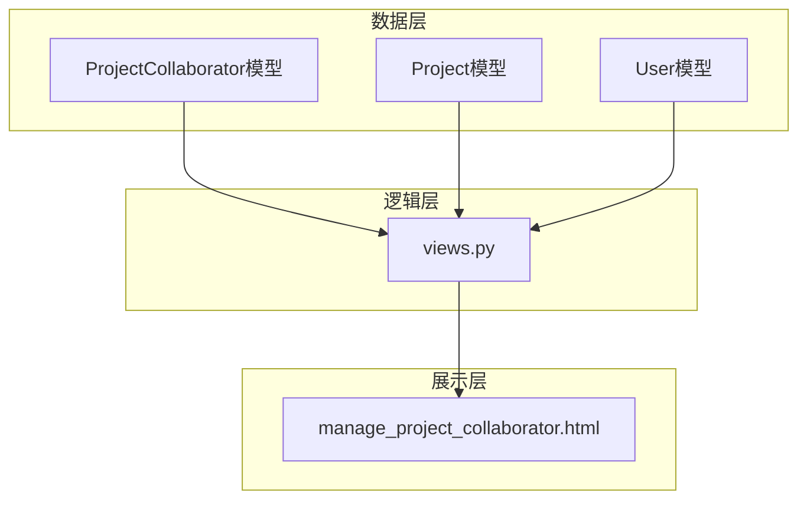
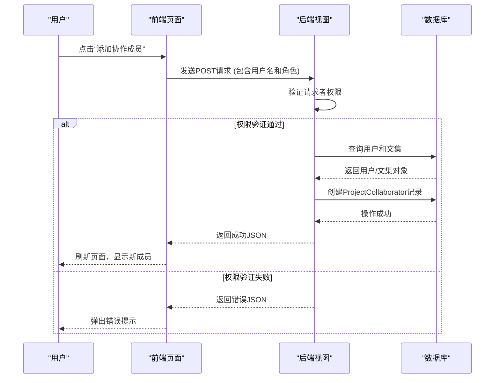
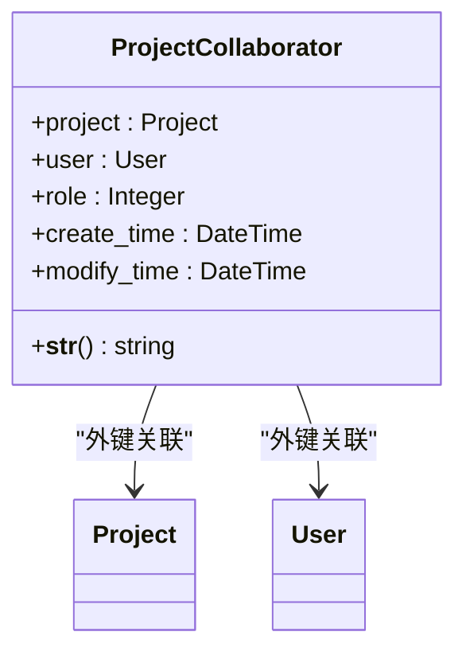
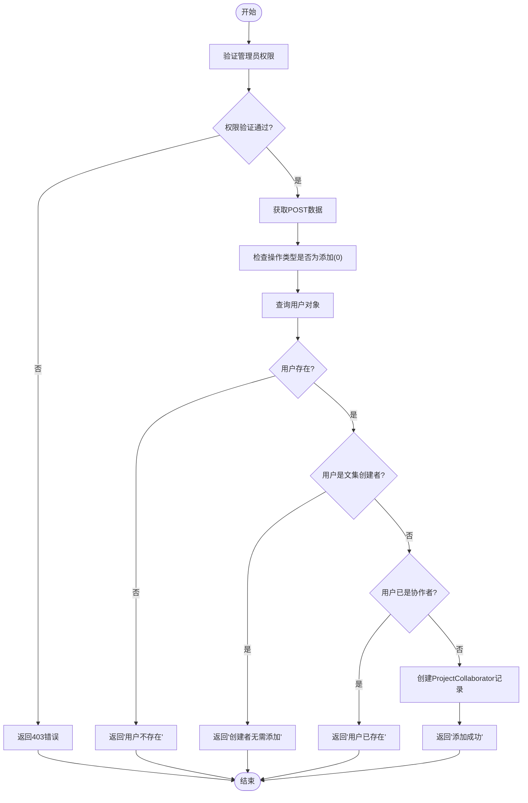
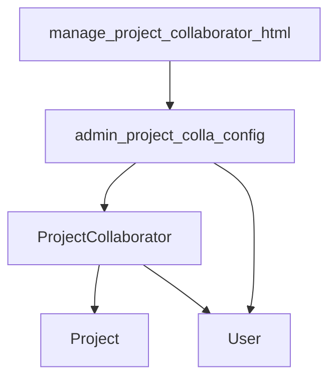

# 项目协作

<cite>
**本文档引用的文件**   
- [models.py](file://app_doc/models.py#L36-L49)
- [views.py](file://app_doc/views.py#L661-L727)
- [manage_project_collaborator.html](file://template/app_doc/manage/manage_project_collaborator.html)
- [admin_project_colla_config.html](file://template/app_admin/admin_project_colla_config.html)
</cite>

## 目录
1. [简介](#简介)
2. [项目结构](#项目结构)
3. [核心组件](#核心组件)
4. [架构概述](#架构概述)
5. [详细组件分析](#详细组件分析)
6. [依赖分析](#依赖分析)
7. [性能考虑](#性能考虑)
8. [故障排除指南](#故障排除指南)
9. [结论](#结论)

## 简介
本文档详细阐述了MrDoc系统中项目协作功能的实现机制。重点分析了`ProjectCollaborator`模型的设计、协作成员权限管理、以及添加、修改和删除协作成员的视图逻辑。文档旨在为初学者提供清晰易懂的指导，同时为经验丰富的开发者提供深入的技术细节，包括API调用、前端交互和常见问题的解决方案。

## 项目结构
项目协作功能主要分布在`app_doc`应用中，涉及模型、视图和模板三个层面。`models.py`定义了数据结构，`views.py`处理业务逻辑，而`template`目录下的HTML文件则负责前端展示。



**图示来源**
- [models.py](file://app_doc/models.py#L36-L49)
- [views.py](file://app_doc/views.py#L661-L727)
- [manage_project_collaborator.html](file://template/app_doc/manage/manage_project_collaborator.html)

## 核心组件
项目协作的核心是`ProjectCollaborator`模型，它通过外键关联`Project`（文集）和`User`（用户），并定义了协作成员的角色权限。

**组件来源**
- [models.py](file://app_doc/models.py#L36-L49)

## 架构概述
系统采用典型的MVC（模型-视图-控制器）架构。用户通过前端页面发起协作管理请求，该请求被路由到后端视图函数。视图函数执行权限验证，操作数据库模型，并返回响应，最终更新前端页面。



**图示来源**
- [views.py](file://app_doc/views.py#L661-L727)
- [manage_project_collaborator.html](file://template/app_doc/manage/manage_project_collaborator.html)

## 详细组件分析

### ProjectCollaborator 模型分析
`ProjectCollaborator`模型是协作功能的数据基石，它定义了协作关系的属性。



**图示来源**
- [models.py](file://app_doc/models.py#L36-L49)

#### 模型字段说明
- **project**: 外键，指向`Project`模型，表示该协作关系所属的文集。
- **user**: 外键，指向Django内置的`User`模型，表示参与协作的用户。
- **role**: 整数字段，表示协作成员的权限级别。其值和含义如下：
  - `0`: **初级权限**。协作成员可以新建文档，并修改或删除自己创建的文档。
  - `1`: **高级权限**。协作成员可以新建文档，修改或删除自己创建的文档，并且可以修改文集中所有其他文档。
- **create_time**: 记录协作关系的创建时间。
- **modify_time**: 记录协作关系的最后修改时间。

### 协作管理视图分析
协作管理的逻辑主要在`app_admin/views.py`文件中的`admin_project_colla_config`视图函数中实现。该函数处理GET和POST两种请求。

#### 添加协作成员流程
当用户提交添加协作成员的表单时，后端执行以下逻辑：



**图示来源**
- [views.py](file://app_doc/views.py#L661-L727)

#### 前端交互分析
前端通过Layui框架的弹出层（layer）和AJAX技术与后端交互。当用户点击“添加”按钮时，会弹出一个包含用户选择下拉框和权限单选框的对话框。

**关键代码示例 (前端)**
```javascript
// 添加文集协作者
addProjectColla = function(pid){
    layer.open({
        type:1,
        title:'添加文集协作者',
        area:['400px','400px'],
        content:$('#add-pro-colla-layer'),
        btn:['确定','取消'],
        success : function(index, layero) {
            form.render('radio'); // 渲染单选框
        },
        yes:function (index,layero) {
            layer.load(1);
            data = {
                'types':0, // 操作类型：0-添加
                'username':$("#user-select").val(), // 选中的用户名
                'role': $('input[name="add-role"]:checked').val() // 选中的角色
            }
            // 发送POST请求到后端
            $.post("",data,function(r){
                layer.closeAll('loading');
                if(r.status){
                    window.location.reload(); // 成功则刷新页面
                }else{
                    layer.msg(r.data) // 失败则弹出错误信息
                }
            })
        },
    })
};
```

**图示来源**
- [manage_project_collaborator.html](file://template/app_doc/manage/manage_project_collaborator.html)

**组件来源**
- [views.py](file://app_doc/views.py#L661-L727)
- [manage_project_collaborator.html](file://template/app_doc/manage/manage_project_collaborator.html)

## 依赖分析
项目协作功能依赖于以下几个核心组件：
- **Django框架**: 提供了ORM、视图、模板和认证系统。
- **User模型**: Django内置的用户模型，用于标识系统用户。
- **Project模型**: 定义了文集的基本属性和权限。
- **Layui前端框架**: 提供了UI组件和JavaScript工具，用于构建交互式前端。



**图示来源**
- [models.py](file://app_doc/models.py#L36-L49)
- [views.py](file://app_doc/views.py#L661-L727)

## 性能考虑
- **数据库查询**: 在管理页面获取协作者列表时，使用了`select_related`或`prefetch_related`来减少数据库查询次数，避免N+1问题。
- **权限验证**: 每次操作前都进行权限验证，确保了数据安全，但会增加少量的数据库查询开销。

## 故障排除指南

### 常见问题及解决方案

#### 问题1: 协作成员权限不生效
**现象**: 协作成员无法执行其权限范围内的操作。
**可能原因**:
1.  **缓存问题**: 浏览器或服务器缓存了旧的权限信息。
2.  **代码逻辑错误**: 视图函数中检查权限的逻辑有误。
**解决方案**:
1.  尝试清除浏览器缓存或使用无痕模式访问。
2.  检查`app_doc/utils.py`中的`check_user_project_writer_role`等权限检查函数，确保其逻辑正确。

#### 问题2: 成员添加失败
**现象**: 点击“添加”后，提示“用户不存在”或“用户已存在”。
**可能原因**:
1.  **用户名输入错误**: 输入的用户名在系统中不存在。
2.  **重复添加**: 试图添加一个已经是协作者的用户。
3.  **权限不足**: 当前用户没有管理该文集的权限。
**解决方案**:
1.  确认用户名拼写正确。
2.  在添加前，先检查该用户是否已在协作列表中。
3.  确保当前用户是文集的创建者或拥有管理员权限。

#### 问题3: 前端按钮无响应
**现象**: 点击“添加”、“修改”或“删除”按钮没有任何反应。
**可能原因**:
1.  **JavaScript错误**: 浏览器控制台报错，导致脚本执行中断。
2.  **CSRF Token缺失**: AJAX请求未携带CSRF Token。
**解决方案**:
1.  打开浏览器开发者工具，查看Console标签页是否有错误信息。
2.  检查前端代码中`$.ajaxSetup`是否正确设置了`csrfmiddlewaretoken`。

## 结论
MrDoc的项目协作功能通过清晰的`ProjectCollaborator`模型和严谨的视图逻辑，实现了对协作成员权限的有效管理。系统提供了初级和高级两种权限级别，满足了不同场景下的协作需求。前端通过AJAX与后端无缝交互，提供了流畅的用户体验。通过本文档的分析，开发者可以深入理解该功能的实现细节，并能有效地进行维护和扩展。