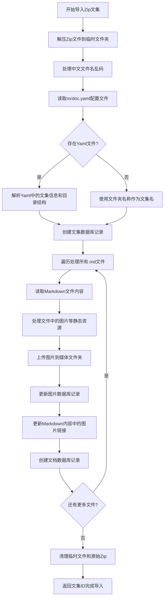
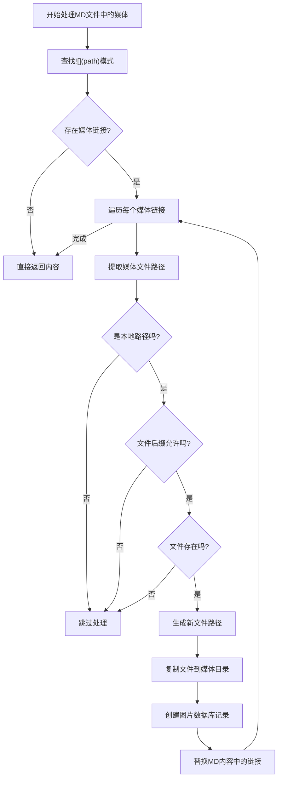
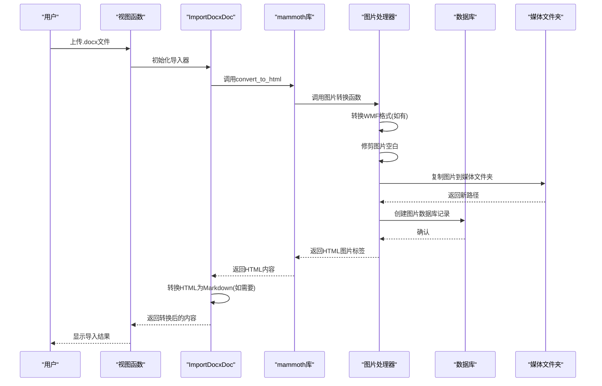

# 项目导入

<cite>
**本文档引用的文件**   
- [import_utils.py](file://app_doc/import_utils.py)
- [views.py](file://app_doc/views.py)
</cite>

## 目录
1. [项目导入](#项目导入)
2. [项目导入工具实现机制](#项目导入工具实现机制)
3. [项目导入视图处理流程](#项目导入视图处理流程)
4. [不同格式项目导入示例](#不同格式项目导入示例)
5. [导入限制与注意事项](#导入限制与注意事项)
6. [常见问题与解决方案](#常见问题与解决方案)

## 项目导入工具实现机制

项目导入功能主要通过 `import_utils.py` 文件中的两个核心类来实现：`ImportZipProject` 用于处理 Zip 压缩包格式的文集导入，`ImportDocxDoc` 用于处理 Word 文档（.docx）的导入。

### Zip 文集导入流程

`ImportZipProject` 类的 `read_zip` 方法实现了完整的 Zip 文集导入流程，其核心步骤如下：



**Diagram sources**
- [import_utils.py](file://app_doc/import_utils.py#L20-L135)

**Section sources**
- [import_utils.py](file://app_doc/import_utils.py#L20-L135)

#### 文件解析与数据映射

导入工具首先解压 Zip 文件到一个临时文件夹，然后处理可能存在的中文文件名乱码问题。接着，它会尝试读取根目录下的 `mrdoc.yaml` 文件，该文件包含了文集的元数据和目录结构信息。

```python
# 读取yaml文件
try:
    with open(os.path.join(self.temp_dir ,'mrdoc.yaml'),'r',encoding='utf-8') as yaml_file:
        yaml_str = yaml.safe_load(yaml_file.read())
        project_name = yaml_str['project_name'] \
            if 'project_name' in yaml_str.keys() else zip_file_path[:-4].split('/')[-1]
        project_desc = yaml_str['project_desc'] if 'project_desc' in yaml_str.keys() else ''
        project_role = yaml_str['project_role'] if 'project_role' in yaml_str.keys() else 1
        editor_mode = yaml_str['editor_mode'] if 'editor_mode' in yaml_str.keys() else 1
        project_toc = yaml_str['toc']
        # ... 解析目录结构
except:
    logger.error(_("未发现yaml文件"))
    # 使用默认值
```

如果未找到 `mrdoc.yaml` 文件，则使用 Zip 文件的文件夹名称作为文集名称，并使用默认值创建文集。

#### 静态资源处理

`operat_md_media` 方法负责处理 Markdown 文件中的图片等静态资源。它使用正则表达式匹配 `` 格式的图片链接，然后检查本地路径是否存在，将图片复制到媒体文件夹，并更新数据库和文件内容中的链接。



**Diagram sources**
- [import_utils.py](file://app_doc/import_utils.py#L137-L188)

**Section sources**
- [import_utils.py](file://app_doc/import_utils.py#L137-L188)

### Word 文档导入流程

`ImportDocxDoc` 类用于将 Word 文档（.docx）转换为 Markdown 或 HTML 格式。它利用 `mammoth` 库进行文档转换，并在转换过程中处理图片。



**Diagram sources**
- [import_utils.py](file://app_doc/import_utils.py#L190-L270)

**Section sources**
- [import_utils.py](file://app_doc/import_utils.py#L190-L270)

#### 错误处理机制

导入工具在关键操作中使用了 Django 的数据库事务，确保了数据的一致性。如果在解析和创建过程中发生异常，事务将被回滚，避免产生不完整的数据。

```python
# 开启事务
with transaction.atomic():
    save_id = transaction.savepoint()
    try:
        # 创建文集和文档
        # ...
    except:
        logger.exception(_("解析导入文件异常"))
        # 回滚事务
        transaction.savepoint_rollback(save_id)
    transaction.savepoint_commit(save_id)
```

此外，工具还使用了 `logger.exception` 来记录详细的错误信息，便于问题排查。

## 项目导入视图处理流程

项目导入的视图逻辑主要在 `views.py` 文件中实现，通过一系列视图函数处理用户请求。

### 文件上传验证

视图函数首先验证用户是否已登录，并检查上传文件的类型和大小。虽然具体的上传处理代码未在提供的片段中，但可以推断出系统会检查文件扩展名（如 `.zip` 或 `.docx`）以确保只处理支持的格式。

### 数据完整性检查

在创建文集时，视图会进行数据完整性检查，例如确保文集名称不为空，并且同一用户下不能存在同名文集。

```python
# 创建文集
@login_required()
@require_http_methods(['POST'])
def create_project(request):
    try:
        name = request.POST.get('pname','')
        name = validateTitle(name)
        # ...
        if name != '':
            # 不允许用户下同名文集存在
            if Project.objects.filter(name=name,create_user=request.user).exists():
                return JsonResponse({'status': False, 'data': _('同名文集已存在！')})
            # ...
        else:
            return JsonResponse({'status':False,'data':_('文集名称不能为空！')})
    except Exception as e:
        logger.exception(_("创建文集出错"))
        return JsonResponse({'status':False,'data':_('出现异常,请检查输入值！')})
```

### 数据库事务管理

虽然在提供的 `views.py` 代码片段中没有直接看到事务管理，但根据 `import_utils.py` 中的实现，可以确定在创建文集和文档时使用了数据库事务来保证操作的原子性。

**Section sources**
- [views.py](file://app_doc/views.py#L260-L285)

## 不同格式项目导入示例

### Markdown 项目导入示例

一个典型的 Markdown 项目 Zip 包结构如下：

```
my-project.zip
├── mrdoc.yaml
├── introduction.md
├── chapter1/
│   ├── section1.md
│   └── section2.md
└── images/
    ├── logo.png
    └── diagram.jpg
```

对应的 `mrdoc.yaml` 文件内容：

```yaml
project_name: 我的项目
project_desc: 这是一个示例项目
project_role: 0
editor_mode: 1
toc:
  - name: 介绍
    file: introduction.md
  - name: 第一章
    file: chapter1/section1.md
    children:
      - name: 第一节
        file: chapter1/section1.md
      - name: 第二节
        file: chapter1/section2.md
```

### HTML 项目导入示例

虽然系统主要支持 Markdown 和 Word 文档，但通过 `mammoth` 库将 Word 转换为 HTML，系统间接支持了 HTML 内容。导入的 HTML 内容随后可以被 `markdownify` 库转换为 Markdown 格式。

## 导入限制与注意事项

### 格式限制

- **Zip 文集**: 必须包含 `.md` 文件，可选 `mrdoc.yaml` 配置文件。
- **Word 文档**: 仅支持 `.docx` 格式，不支持旧版 `.doc` 格式。
- **图片格式**: 仅支持 `settings.ALLOWED_IMG` 中定义的图片格式。

### 注意事项

- **文件路径**: Zip 包内的图片路径应为相对路径（如 `./images/logo.png`）。
- **编码**: 建议使用 UTF-8 编码保存 Markdown 文件。
- **文件大小**: 过大的文件可能导致内存不足或超时。

## 常见问题与解决方案

### 导入失败

**问题**: 导入过程中出现 "解析导入文件异常" 错误。

**解决方案**:
1. 检查 Zip 文件是否损坏，尝试重新压缩。
2. 确认 `mrdoc.yaml` 文件的 YAML 语法是否正确。
3. 检查 Markdown 文件中是否有不兼容的特殊字符。

### 数据丢失

**问题**: 导入后发现部分图片或文档丢失。

**解决方案**:
1. 检查 Zip 包中丢失文件的路径是否正确。
2. 确认图片文件的后缀名是否在系统允许的列表中。
3. 查看日志文件，寻找具体的错误信息。

### 格式不兼容

**问题**: Word 文档中的复杂格式（如表格、公式）显示异常。

**解决方案**:
1. `mammoth` 库对复杂 Word 格式的支持有限，建议在 Word 中简化格式后再导出。
2. 对于数学公式，考虑使用 LaTeX 语法在 Markdown 中重新编写。