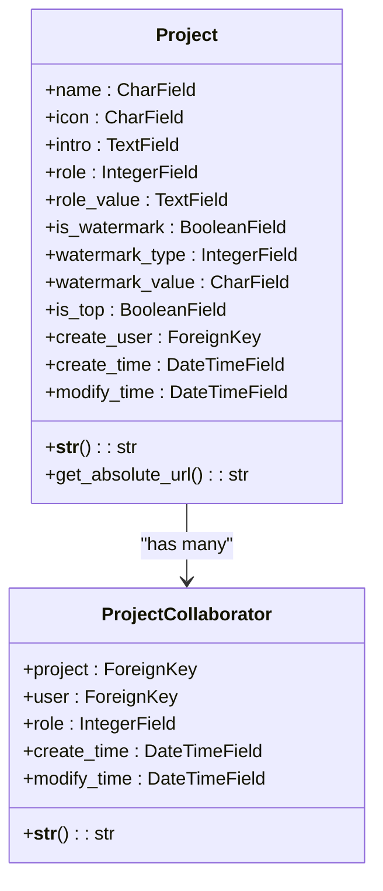
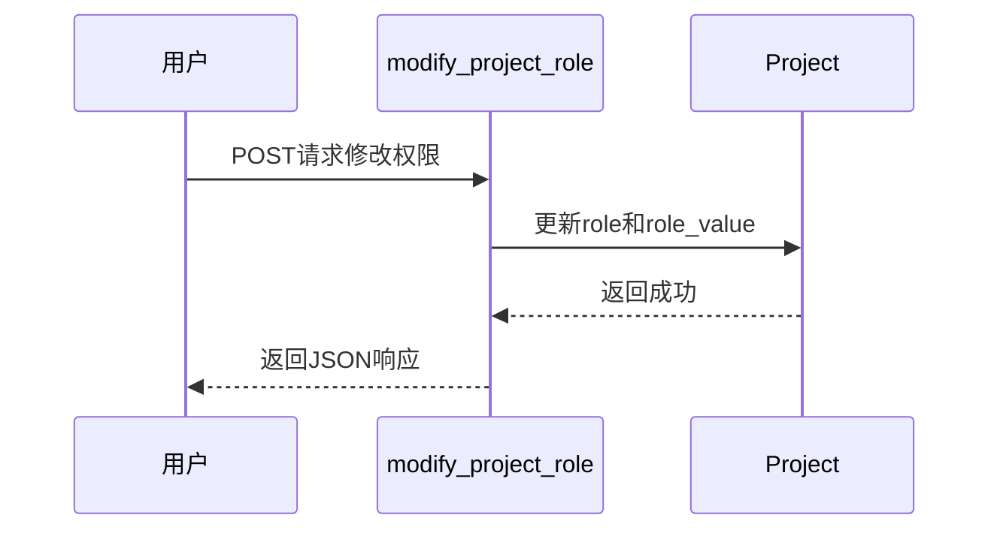
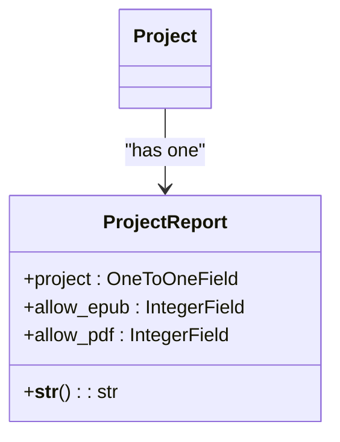
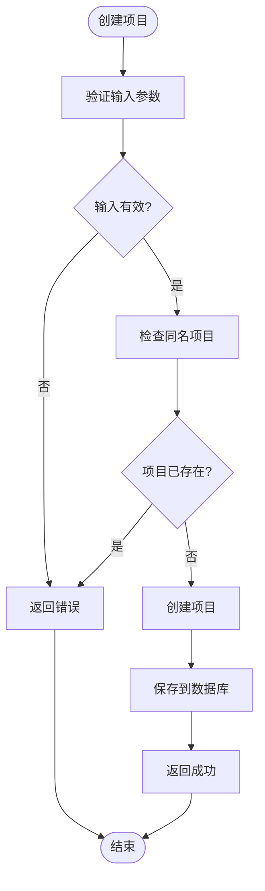
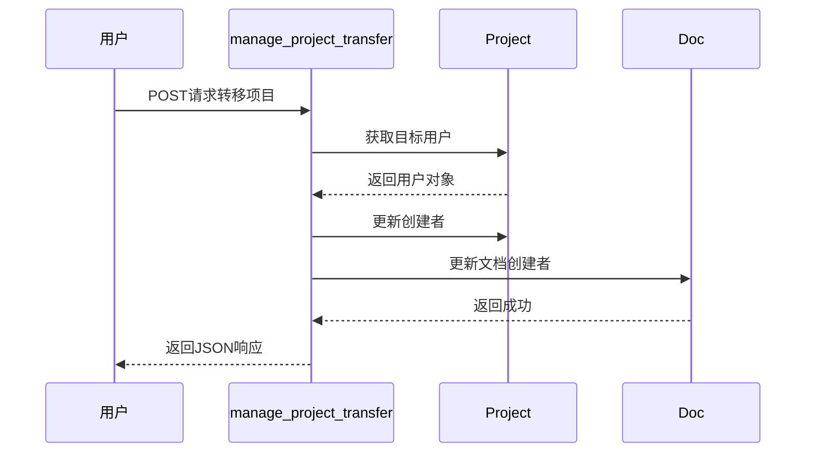

# 项目管理

<cite>
**本文档引用的文件**   
- [models.py](file://app_doc/models.py#L1-L270)
- [views.py](file://app_doc/views.py#L1-L3550)
- [manage_project.html](file://template/app_doc/manage/manage_project.html)
- [manage_project_collaborator.html](file://template/app_doc/manage/manage_project_collaborator.html)
- [manage_project_doc_sort.html](file://template/app_doc/manage/manage_project_doc_sort.html)
- [manage_project_import.html](file://template/app_doc/manage/manage_project_import.html)
- [manage_project_options.html](file://template/app_doc/manage/manage_project_options.html)
- [manage_project_self_colla.html](file://template/app_doc/manage/manage_project_self_colla.html)
- [manage_project_transfer.html](file://template/app_doc/manage/manage_project_transfer.html)
</cite>

## 目录
1. [项目管理](#项目管理)
2. [项目模型实现](#项目模型实现)
3. [项目权限与协作](#项目权限与协作)
4. [项目配置选项](#项目配置选项)
5. [项目视图功能](#项目视图功能)
6. [常见问题与解决方案](#常见问题与解决方案)

## 项目模型实现

`Project` 模型是项目管理的核心，定义了项目的基本属性和行为。该模型包含项目名称、图标、介绍、权限设置、水印状态、置顶状态以及创建用户等字段。

**图示来源**
- [models.py](file://app_doc/models.py#L1-L270)

**本节来源**
- [models.py](file://app_doc/models.py#L1-L270)

## 项目权限与协作

项目权限通过 `role` 字段进行管理，支持四种权限模式：公开（0）、私密（1）、指定用户可见（2）和访问码可见（3）。`role_value` 字段用于存储权限相关的值，如指定用户列表或访问码。

项目协作通过 `ProjectCollaborator` 模型实现，允许用户将其他用户添加为协作者，并设置协作模式。协作模式包括：可新建文档并修改自己的文档（0），或可新建文档并修改所有文档（1）。

**图示来源**
- [views.py](file://app_doc/views.py#L400-L450)
- [models.py](file://app_doc/models.py#L1-L270)

**本节来源**
- [views.py](file://app_doc/views.py#L400-L450)
- [models.py](file://app_doc/models.py#L1-L270)

## 项目配置选项

项目配置选项包括是否置顶显示、水印设置和PDF导出权限等。`is_top` 字段控制项目是否在列表中置顶显示。水印功能通过 `is_watermark`、`watermark_type` 和 `watermark_value` 字段实现，支持文字水印和图片水印。

PDF导出权限由 `ProjectReport` 模型管理，通过 `allow_pdf` 字段控制是否允许前台导出PDF文件。

**图示来源**
- [models.py](file://app_doc/models.py#L1-L270)

**本节来源**
- [models.py](file://app_doc/models.py#L1-L270)

## 项目视图功能

项目视图功能通过 `views.py` 中的多个视图函数实现，包括创建、修改、删除和管理项目。`create_project` 函数处理项目创建请求，`modify_project` 函数处理项目修改请求，`del_project` 函数处理项目删除请求。

项目管理界面通过 `manage_project` 函数提供，支持分页显示和搜索功能。项目文档排序通过 `manage_project_doc_sort` 函数实现，允许用户通过拖拽方式调整文档顺序。

**图示来源**
- [views.py](file://app_doc/views.py#L200-L300)

**本节来源**
- [views.py](file://app_doc/views.py#L200-L300)

## 常见问题与解决方案

### 项目权限设置错误

当用户无法访问项目时，首先检查项目权限设置。对于私密项目，只有创建者和协作者可以访问。对于指定用户可见项目，需要确保用户名在 `role_value` 列表中。对于访问码可见项目，需要通过 `check_viewcode` 视图进行访问码验证。

### 项目转移失败

项目转移功能通过 `manage_project_transfer` 函数实现。转移失败的常见原因是目标用户不存在。在转移前，需要通过 `User.objects.get(username=user_name)` 验证用户存在性。转移成功后，系统会更新项目创建者和相关文档的创建者。

**图示来源**
- [views.py](file://app_doc/views.py#L1000-L1050)
- [models.py](file://app_doc/models.py#L1-L270)

**本节来源**
- [views.py](file://app_doc/views.py#L1000-L1050)
- [models.py](file://app_doc/models.py#L1-L270)