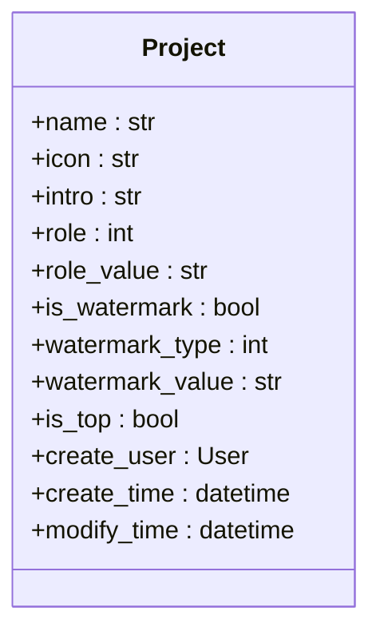
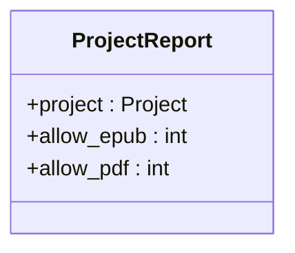

# 项目配置

<cite>
**本文档引用文件**  
- [models.py](file://app_doc/models.py)
- [views.py](file://app_doc/views.py)
</cite>

## 目录
1. [项目配置](#项目配置)
2. [核心配置字段](#核心配置字段)
3. [配置更新视图](#配置更新视图)
4. [配置变更影响](#配置变更影响)
5. [常见问题与调试](#常见问题与调试)

## 核心配置字段

项目配置功能主要通过 `Project` 模型和 `ProjectReport` 模型实现。`Project` 模型定义了文集的基本属性和权限设置，而 `ProjectReport` 模型则管理文集的导出权限。

### 项目模型 (Project)
`Project` 模型定义了文集的核心配置选项，包括是否置顶、权限设置和水印状态等。



**Diagram sources**  
- [models.py](file://app_doc/models.py#L4-L45)

**Section sources**  
- [models.py](file://app_doc/models.py#L4-L45)

#### 置顶配置
`is_top` 字段用于控制文集是否在列表中置顶显示。该字段是一个布尔值，默认为 `False`。

```python
is_top = models.BooleanField(verbose_name="是否置顶", default=False)
```

#### 权限配置
`role` 字段定义了文集的访问权限，支持四种权限级别：
- **0**: 公开 - 任何人都可以访问
- **1**: 私密 - 仅创建者和协作者可以访问
- **2**: 指定用户可见 - 只有指定的用户可以访问
- **3**: 访问码可见 - 需要输入访问码才能访问

`role_value` 字段存储了权限相关的值，如指定用户列表或访问码。

### 项目导出模型 (ProjectReport)
`ProjectReport` 模型管理文集的前台导出权限，包括 PDF 和 EPUB 格式的导出。



**Diagram sources**  
- [models.py](file://app_doc/models.py#L220-L230)

**Section sources**  
- [models.py](file://app_doc/models.py#L220-L230)

`allow_pdf` 字段控制是否允许前台导出 PDF 文件，`allow_epub` 字段控制是否允许前台导出 EPUB 文件。这两个字段都是整数类型，`0` 表示允许，`1` 表示不允许。

## 配置更新视图

配置更新功能通过 `views.py` 中的视图函数实现，主要包括修改文集信息、权限和导出配置。

### 修改文集信息
`modify_project` 视图处理文集基本信息的更新，包括名称、图标、描述、水印状态等。

```python
@login_required()
@require_http_methods(['GET','POST'])
def modify_project(request):
    if request.method == 'POST':
        try:
            pro_id = request.POST.get('pro_id',None)
            project = Project.objects.get(id=pro_id)
            if (request.user == project.create_user) or request.user.is_superuser:
                name = request.POST.get('name',None)
                icon = request.POST.get('picon', None)
                content = request.POST.get('desc',None)
                is_watermark = request.POST.get('is_watermark',False)
                if is_watermark == 'true':
                    is_watermark = True
                else:
                    is_watermark = False
                watermark_value = request.POST.get('watermark_value','')
                project.name = validateTitle(name)
                project.intro = content
                project.icon = icon
                project.is_watermark = is_watermark
                project.watermark_value = watermark_value
                project.save()
                return JsonResponse({'status':True,'data':_('修改成功')})
            else:
                return JsonResponse({'status':False,'data':_('非法请求')})
        except Exception as e:
            logger.exception(_("修改文集出错"))
            return JsonResponse({'status':False,'data':_('请求出错')})
```

### 修改导出配置
`modify_project_download` 视图处理文集导出权限的更新。

```python
@login_required()
@require_http_methods(['GET',"POST"])
@logger.catch()
def modify_project_download(request,pro_id):
    try:
        pro = Project.objects.get(id=pro_id)
    except ObjectDoesNotExist:
        return Http404
    if (pro.create_user != request.user) and (request.user.is_superuser is False):
        return render(request,'403.html')
    else:
        if request.method == 'POST':
            download_epub = request.POST.get('download_epub',None)
            download_pdf = request.POST.get('download_pdf', None)
            if download_epub == 'on':
                epub_status = 1
            else:
                epub_status = 0
            if download_pdf == 'on':
                pdf_status = 1
            else:
                pdf_status = 0
            ProjectReport.objects.update_or_create(
                project = pro,defaults={'allow_epub':epub_status}
            )
            ProjectReport.objects.update_or_create(
                project=pro, defaults={'allow_pdf': pdf_status}
            )
            return JsonResponse({'status':True,'data':'ok'})
```

**Section sources**  
- [views.py](file://app_doc/views.py#L788-L825)

## 配置变更影响

配置变更会直接影响项目的可见性和功能可用性。

### 置顶配置影响
当 `is_top` 字段设置为 `True` 时，该文集会在文集列表中置顶显示。这在 `project_list` 视图中通过 `order_by('-is_top', ...)` 实现。

```python
project_list = Project.objects.filter(...).order_by('-is_top',"{}create_time".format(sort_str))
```

### 导出权限影响
导出权限配置会影响用户是否能够生成和下载文集的 PDF 或 EPUB 文件。在 `genera_project_file` 视图中，会检查 `ProjectReport` 模型中的 `allow_pdf` 和 `allow_epub` 字段来决定是否允许生成文件。

## 常见问题与调试

### 配置不保存
如果配置更新后没有保存，可能是由于权限验证失败。确保请求用户是文集的创建者或超级用户。

```python
if (request.user == project.create_user) or request.user.is_superuser:
    # 允许更新
else:
    return JsonResponse({'status':False,'data':_('非法请求')})
```

### 权限设置错误
权限设置错误可能导致用户无法访问文集。检查 `role` 和 `role_value` 字段的值是否正确。

- **公开文集**: `role=0`
- **私密文集**: `role=1`
- **指定用户可见**: `role=2`, `role_value` 包含用户名列表
- **访问码可见**: `role=3`, `role_value` 包含访问码

### 调试方法
1. 检查数据库中的 `Project` 和 `ProjectReport` 表，确认配置值是否正确。
2. 查看日志文件，检查是否有异常信息。
3. 使用 Django shell 交互式地测试配置更新逻辑。

```bash
python manage.py shell
```